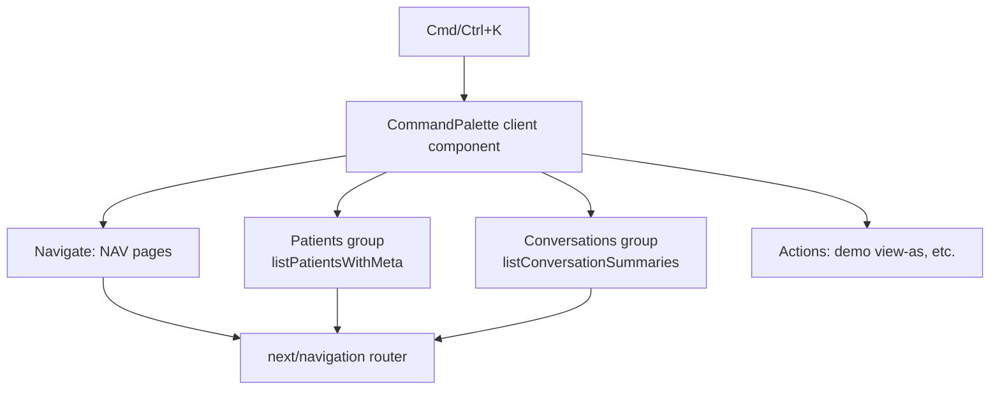

# Global Command Palette with cmdk

`cmdk` (canonical package: [pacocoursey/cmdk](https://github.com/pacocoursey/cmdk)) is an unstyled, accessible ⌘K command-menu primitive. It's React 19 compatible and ships its own fuzzy filtering, keyboard nav, and ARIA combobox semantics — so we only provide data and styling.

## Architecture

The palette mounts once in [dashboard/app/layout.tsx](dashboard/app/layout.tsx) inside `DemoIdentityProvider` (so it can read `viewAs`/concierges) and uses Convex `useQuery` for live search data.

## Phase 1 - Foundation (navigation + shortcut)
- Add `cmdk` to [dashboard/package.json](dashboard/package.json).
- Create `dashboard/features/command/command-palette.tsx` (client component): a `Command.Dialog` with global `Cmd/Ctrl+K` listener (and Escape to close), styled with existing tokens (`bg-card`, `border-border`, `rounded-card`, `focus-ring`, `text-muted`).
- Reuse the `NAV` array — extract it from [sidebar.tsx](dashboard/components/layout/sidebar.tsx) into a shared `dashboard/features/command/nav-items.ts` (or a `lib` constant) so the sidebar and palette stay in sync. Selecting an item calls `router.push(href)`.
- Mount `<CommandPalette />` in [layout.tsx](dashboard/app/layout.tsx).

## Phase 2 - Entity search
- Patients group: `useQuery(api.queries.listPatientsWithMeta, { viewAs })`, render rows as `Command.Item` (label `patient.name`, hint `patient.handle`/procedure), select -> `/patients/[id]`. Mirror the haystack logic in [use-patient-roster.ts](dashboard/features/patients/use-patient-roster.ts) (`name + handle`).
- Conversations group: `useQuery(api.queries.listConversationSummaries, { viewAs })`, select -> `/conversations/[id]`.
- Use `Command.Group` headings + `Command.Empty`. Let cmdk's built-in filter handle matching (set a `value` per item combining name + handle).

## Phase 3 - Actions (optional)
- "View as <concierge>" items wired to `useDemoIdentity().setViewAs` (gated by `demoEnabled`), replicating [demo-role-switcher.tsx](dashboard/features/demo/demo-role-switcher.tsx).
- Room for future verbs (assign, escalate) reusing existing mutations.

## Polish
- Add a subtle "⌘K" affordance in the sidebar header.
- Respect `prefers-reduced-motion` (consistent with [dialog.tsx](dashboard/components/ui/dialog.tsx)).
- `cmdk`'s `Command.Dialog` already provides focus trap + restore, so we don't need the custom trap from `dialog.tsx`.

## Verify
- `cd dashboard && pnpm typecheck` and `pnpm dev`, then exercise ⌘K: navigate, search a patient, open a conversation.