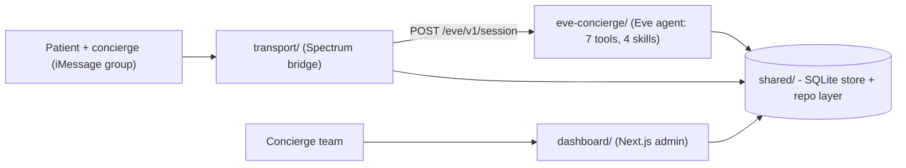

## Documentation + Decision Docs

Goal: make the repo self-explanatory for a work-trial reviewer and capture the architecture decisions from this session. Follow the existing ADR style in [.docs/decisions/001-escalation-taxonomy.md](.docs/decisions/001-escalation-taxonomy.md) (`# Title` -> `## Decision` -> supporting sections). No code changes; docs only. The `.cursor/plans/*` files are off-limits.

### 1. New decision docs (`.docs/decisions/`, continuing 001-004)

- **`005-eve-agent-project-structure.md`** - The nested Eve layout and the `agent/` -> `eve-concierge/` rename. Covers Eve's app-root detection (walks up to the nearest dir containing `agent/`), why the flat `agent/` at repo root mis-resolved the app root and broke `eve dev` module resolution, and why the agent is an isolated sub-project (own `pnpm-lock.yaml`, excluded from the root workspace, `@essos/shared` via `link:`). Includes the `eve-concierge/.env` symlink so Eve loads env from its app root.
- **`006-model-routing-direct-anthropic.md`** - Routing directly to Anthropic via `@ai-sdk/anthropic` instead of the Vercel AI Gateway. Rationale: the work-trial key is a raw ZDR Anthropic key (gateway needs `AI_GATEWAY_API_KEY`/OIDC), and direct routing keeps PHI off a third-party gateway. Records the model id (`claude-sonnet-4-5`, hyphenated direct id vs dotted gateway slug) and disabling the provider-managed `web_search` built-in via `disableTool()`; notes the still-enabled `bash`/file built-ins as a known follow-up.
- **`007-admin-dashboard-architecture.md`** - Next.js App Router admin app reads the shared SQLite directly through `@essos/shared` (no API layer), `serverExternalPackages` for the native `node:sqlite` dep, server actions for resolve / take-over / resume with `revalidatePath`, brand tokens from `.essos_branding`, and the source-doc PDF route.
- **`008-transport-eve-streaming-contract.md`** - The Eve session HTTP contract (`POST /eve/v1/session`, stream `GET .../stream`) and the ndjson event schema (`message.appended.data.messageSoFar`, per-step `message.completed.data.{message,finishReason}`, terminating `turn.completed`/`*.failed`). Documents why `collectReply` keeps the final non-`tool-calls` message, plus patient-binding-by-handle and concierge takeover.

### 2. Decisions index

- **`.docs/decisions/README.md`** - One-line summary + link for ADRs 001-008, and a short note on the ADR format.

### 3. Root README

- **`README.md`** (new, the centerpiece): product overview (text concierge in the iMessage group, autonomous low-severity + human escalation), an architecture mermaid diagram (patient -> Spectrum transport -> Eve agent -> shared SQLite <- dashboard), repo layout, prerequisites (Node 22+/pnpm), `.env` setup, install/build/seed, run commands (`pnpm eve:dev`, `transport:terminal`/`imessage`, `dashboard:dev`), the canonical demo scenarios, the iMessage test runbook (patient handle binding, concierge handles), a documented-assumptions section, and a links table to all ADRs.

### 4. Per-package READMEs

- **`eve-concierge/README.md`** - the agent "brain": nested layout, the 7 tools + 4 skills, `instructions.md` escalation policy, direct-Anthropic model config, `eve dev`/`eve build`, disabling built-ins.
- **`transport/README.md`** - Spectrum bridge: terminal vs iMessage providers, `handleInbound` flow, patient resolution by handle, concierge takeover/pause, the Eve streaming client.
- **`dashboard/README.md`** - views (overview/queue, conversations, patient/itinerary, telemetry), server actions, direct-DB data source, run/build.
- **`shared/README.md`** - SQLite schema + migrations, the `repo.ts` query/command layer, escalation taxonomy, `places.ts`, `seed.ts` (fixture-driven), and `config.ts` repo-root/db-path resolution.

### 5. Fix stale doc

- **`mock-assets/README.md`** - update the two `output/pdf/essos/` references to `mock-assets/pdf/essos/` to match the current generator/manifest output.

### Architecture diagram (for the root README)

### Notes

- Eight files created, one updated; all under `.docs/`, package roots, and repo root.
- ADRs reuse the existing format and cross-link related docs (e.g. 006 links to 005; root README links all).
