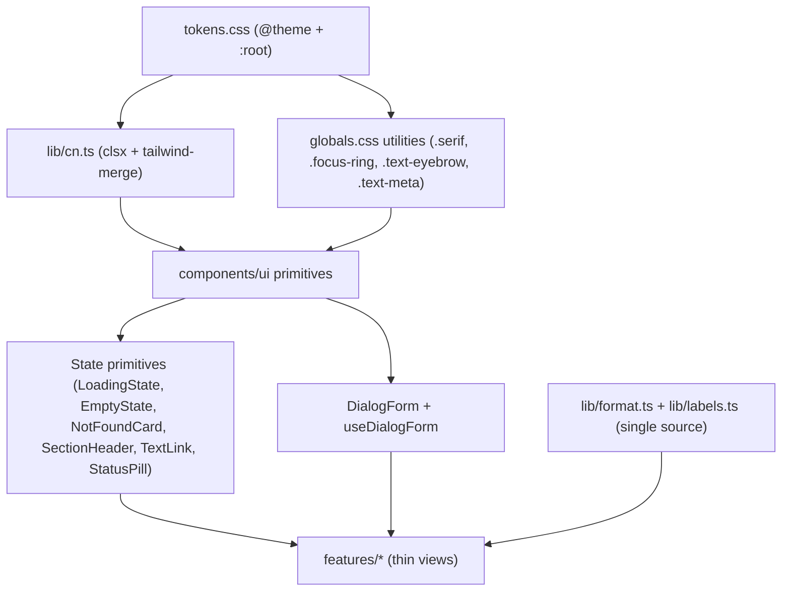

# Dashboard Design System: S-Tier Overhaul

Goal: make `dashboard/` a reference-grade Next.js + Tailwind v4 codebase — a tokenized design system, composable primitives, thin decomposed features, and clean accessibility. Aggressive refactor, no back-compat shims; all call sites updated.

The audit (three explore passes) confirmed the color/radius/shadow foundation is solid, but found: no `cn()` helper (template-string concat everywhere), duplicated control/card recipes, a documentation-only typography scale, ~9 inline state/link/pill patterns, 4 near-identical CRUD dialogs (~190 lines each), a 259-line patients list and 218-line reply box, scattered formatters, and real a11y gaps in `Dialog`/`Field`.

## Target layering

## Phase 1 - Class-merge foundation

- Add `dashboard/lib/cn.ts` exporting `cn(...inputs)` built on `clsx` + `tailwind-merge` (add both deps). This makes caller `className` last-wins and removes trailing-empty-string concat.
- Replace every `` `${BASE} ${className ?? ""}` `` with `cn(BASE, className)` across `components/ui/*`, `components/layout/*`, `components/badges/*`.

## Phase 2 - Token + typography hardening (`dashboard/app/styles/tokens.css`, `globals.css`)

- Add a semantic type scale under `@theme` `--text-*` (e.g. `--text-meta` 10px, plus line-heights) to kill recurring `text-[10px]`/`text-[11px]` magic numbers.
- Add `@utility text-eyebrow` and `@utility text-meta` in `globals.css` for the repeated `text-[11px] uppercase tracking-wide text-muted` and `font-mono text-[10px] tracking-wide` combos.
- Wire brand OpenType features from `DESIGN.md` (`cv03`,`cv04`,`cv09`,`cv11`,`blwf`) via a `--font-features` var applied on `body` so ABC Repro renders per brand spec.
- Expose content width as a real utility (`--container-content` -> `max-w-content`) replacing `max-w-[var(--w-content)]` in [layout.tsx](dashboard/app/layout.tsx).
- Reduce verbose `duration-[var(--duration-fast)] ease-[var(--ease-out)]` call sites: centralize them inside the extracted component base strings (Phase 3) so the arbitrary syntax lives in one place each.
- Prune defined-but-unused tokens (`--shadow-pop`, `--ease-in-out`, `--ease-drawer`, `--color-stone-30/40/60/80`, `--color-black`) OR document them as an intentional reserved ramp; default: prune unused easings/shadow, keep the full stone ramp documented as the brand scale.

## Phase 3 - Control/surface recipe extraction + Button fixes

- Extract the duplicated form-control recipe (identical in [input.tsx](dashboard/components/ui/input.tsx), [textarea.tsx](dashboard/components/ui/textarea.tsx), [select.tsx](dashboard/components/ui/select.tsx)) into one shared `controlBase` constant; select opts out of `placeholder:` only.
- Give [select.tsx](dashboard/components/ui/select.tsx) a proper custom chevron + `appearance-none`.
- [button.tsx](dashboard/components/ui/button.tsx): default `type="button"` (fixes accidental form submit), replace `text-white` with `text-pearl` in variants, replace `text-[11px]` size with the new `text-meta`/token.
- Replace the inline surface-box recipe in [concierge-identity.tsx](dashboard/components/layout/concierge-identity.tsx) and the raw `<button>` sign-in with the design-system primitives.

## Phase 4 - Shared state/content primitives + icons

- New in `components/ui/`: `LoadingState`, `EmptyState`, `NotFoundCard` (Card + message + back `TextLink`), `SectionHeader` (title + optional action, one heading scale), `TextLink` (the `text-primary ... hover:underline` pattern), `StatusPill` (route the inline `bg-high-soft`/`bg-primary/10` pills + `Badge` through one API), and `DefinitionList` to wrap `DefinitionRow` for valid `<dl>` semantics.
- Add a generic, shimmering `<Skeleton>` primitive in `components/ui/skeleton.tsx` and compose it into layout skeletons (e.g. `PatientRowSkeleton`) to eliminate Cumulative Layout Shift (CLS).
- New `components/icons/` module for inline SVGs currently embedded in features: `DocIcon` ([concierge-reply-box.tsx](dashboard/features/conversations/concierge-reply-box.tsx)), `SparkleIcon` ([message-bubble.tsx](dashboard/features/conversations/message-bubble.tsx)).
- New `components/charts/BarMeter` for the hand-rolled bars in [performance-view.tsx](dashboard/features/performance/performance-view.tsx) with built-in `role`/`aria-label`.
- Adopt all of the above across the ~20 feature files that currently inline these patterns.

## Phase 5 - Dialog form scaffold (biggest dedupe)

- Refactor `Dialog` to use the **Compound Component Pattern** (`Dialog`, `Dialog.Content`, `Dialog.Header`, `Dialog.Title`, `Dialog.Description`, `Dialog.Body`, `Dialog.Footer`) to allow maximum layout flexibility while encapsulating focus trapping, escape-key handling, and ARIA attributes.
- Add `useDialogForm` hook (manages `pending`/`error`/`handleSubmit` try/catch/finally) and a `DialogForm` wrapper (standard Cancel + submit footer with `Saving...` state + the shared error line) in `components/ui/`.
- Refactor all four CRUD dialogs to use it: [patient-form-dialog.tsx](dashboard/features/patients/patient-form-dialog.tsx), [itinerary-event-dialog.tsx](dashboard/features/patients/itinerary-event-dialog.tsx), [care-instruction-dialog.tsx](dashboard/features/patients/care-instruction-dialog.tsx), [document-upload-dialog.tsx](dashboard/features/patients/document-upload-dialog.tsx).

## Phase 6 - Feature decomposition

- [patients-list-view.tsx](dashboard/features/patients/patients-list-view.tsx) (259 lines): extract `usePatientRoster` hook (filter/sort/group memos + `sortRows`), a `PatientFilters` toolbar, and promote `PatientRow` to its own file.
- [concierge-reply-box.tsx](dashboard/features/conversations/concierge-reply-box.tsx) (218 lines): flatten the 4-level identity wrapper chain into a single resolver hook (`useConciergeSignature`), move `DocIcon` to the icons module.
- [conversation-detail-view.tsx](dashboard/features/conversations/conversation-detail-view.tsx): extract the `unansweredCount`/`openEscalation`/`draftSources` derivations into a `useConversationThread` selector.

## Phase 7 - lib consolidation (single source of truth)

- Move `fmtMs`/`pct` ([performance-view.tsx](dashboard/features/performance/performance-view.tsx)) and `fmtDuration` ([team-view.tsx](dashboard/features/team/team-view.tsx)) into [lib/format.ts](dashboard/lib/format.ts) as one `formatDuration`.
- Add `pluralize`, an `UNASSIGNED_LABEL` constant, an `org:`-prefix stripper, and a `buildSignature(name)` helper; replace all inline copies.
- Route every inline `.replace(/_/g, " ")` through `humanize`; use `PROCEDURE_OPTIONS` from [options.ts](dashboard/features/patients/options.ts) in the patients filter instead of hardcoded `<option>`s.

## Phase 8 - Consistency normalization

- Use **Component-Level CSS Variables** on `MessageBubble` to handle dynamic, role-based styles elegantly instead of complex template string concatenation.
- Standardize secondary text to the `text-muted` token (replace `text-ink/80`, `text-ink/70`, `text-secondary`, `text-muted/70` where they mean "muted").
- Standardize on-dark text to `text-pearl` (remove `text-white`).
- Standardize page rhythm: page roots `space-y-8`, in-page sections `space-y-6`/`space-y-4` by a documented rule; loading/empty always rendered the same way (via the new primitives).
- Replace raw `<select>` in [assign-control.tsx](dashboard/features/patients/assign-control.tsx) and [demo-role-switcher.tsx](dashboard/features/demo/demo-role-switcher.tsx) with the shared `Select`.
- Add `dot` to [policy-badge.tsx](dashboard/components/badges/policy-badge.tsx); reconcile/document the `taken_over` color divergence between Automation/Status badges.

## Phase 9 - Accessibility

- [dialog.tsx](dashboard/components/ui/dialog.tsx): add focus trap, initial focus, return-focus-on-close, and wire `aria-labelledby`/`aria-describedby` to the title/description.
- [field.tsx](dashboard/components/ui/field.tsx): actually inject the generated `id` into the child control (or document the contract) and add `aria-invalid`/`aria-describedby` for the error.
- [assign-control.tsx](dashboard/features/patients/assign-control.tsx): label the reassign select.
- Charts in [performance-view.tsx](dashboard/features/performance/performance-view.tsx): accessible `role="img"` + summary via the new `BarMeter`.

## Verification

- `npm run typecheck` and `npm run build` in `dashboard/` after each phase (and at the end).
- Visual QA: overview, conversations + detail, patients + detail, performance, team. Confirm dialogs trap focus, keyboard nav works, fonts render brand features, and no layout shift.
- Grep guards: zero `text-[1\dpx]`, zero `text-white`, zero `${...className ?? ""}` concat, zero inline `.replace(/_/g, " ")` remaining.
