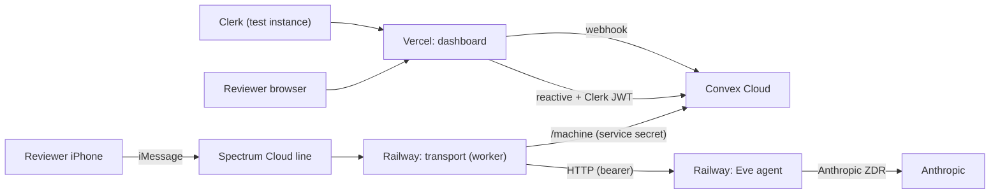

# Deploy Essos: Convex Cloud + Vercel + Railway

Take the working local build live. Topology decided with you: **Eve + transport on Railway**, **dashboard on Vercel**, **data on Convex Cloud**, **Clerk** reused (test instance). Guest mode on so reviewers can text the Spectrum line and chat with Eve.

Secrets you pasted (Convex deploy key, Railway token) will be used as-is; rotate after the trial.

## Phase 0 - Prereqs / tooling
- Upgrade Railway CLI off 4.35.0: `npm i -g @railway/cli@latest` (or `brew upgrade railway`); export `RAILWAY_TOKEN=bd9258f9-...`; verify with the Railway MCP `whoami` and `railway whoami`.
- Confirm `vercel` (50.x) and `npx convex` (1.41) auth: `vercel whoami` (login if needed); Convex uses the deploy key (no login).
- Railway guidance comes from the Railway MCP (`docs_search`/`docs_fetch`, `create_project`, `create_service`, `set_variables`, `deploy`, `generate_domain`, `get_logs`). If you have a specific "Railway AI skill" package in mind, point me at it; otherwise the MCP docs tools cover it.

## Phase 1 - Convex Cloud (do first; everything needs its URLs)
- Use the **production** deploy key for deployment `intent-hare-36` -> stable URLs `https://intent-hare-36.convex.cloud` (reactive client) and `https://intent-hare-36.convex.site` (HTTP actions / `/machine`).
- Deploy: `CONVEX_DEPLOY_KEY="prod:intent-hare-36|..." npx convex deploy` from repo root.
- Set prod env (CLI with the deploy key, or Convex MCP `envSet` pointed at the cloud deployment):
  - `CLERK_JWT_ISSUER_DOMAIN=https://peaceful-cobra-81.clerk.accounts.dev`
  - `CONVEX_SERVICE_SECRET=<new strong random>` (shared with the transport)
  - `ESSOS_DEMO_MODE=1`, `ESSOS_GUEST_MODE=1`
  - temporarily `ESSOS_ALLOW_SEED=1`
- Seed the cloud: with `CONVEX_URL=https://intent-hare-36.convex.cloud` and `CLERK_SECRET_KEY` exported, run `pnpm seed:reset` then `pnpm seed:team` (creates the demo Clerk org + Tess/Ada/Ben and assigns patients). Then clear `ESSOS_ALLOW_SEED`.

## Phase 2 - Railway project (Eve + transport)
- Create one project (`create_project`), one environment (production). Both services deploy the full repo (Eve links `@essos/shared`, transport depends on it).
- **Service `eve`** (web):
  - Build: `corepack enable && pnpm install && pnpm --filter @essos/shared build && pnpm -C eve-concierge install && pnpm -C eve-concierge build`
  - Start: `pnpm -C eve-concierge start` (verify `eve start` binds `$PORT`; pass `--port $PORT` if needed)
  - Vars: `ANTHROPIC_API_KEY`, `ESSOS_AGENT_MODEL=claude-sonnet-4-5`, `ESSOS_TRANSPORT_SECRET=<new>` (required since the transport reaches Eve non-loopback per [ADR 009](.docs/decisions/009-agent-hardening-and-transport-auth.md)).
  - Use Railway **private networking** so the transport reaches Eve at `eve.railway.internal:$PORT` (no public exposure needed).
- **Service `transport`** (worker, no domain):
  - Build: `corepack enable && pnpm install && pnpm --filter @essos/shared build`
  - Start: `pnpm --filter @essos/transport run imessage`
  - Vars: `CONVEX_SITE_URL=https://intent-hare-36.convex.site`, `CONVEX_SERVICE_SECRET=<same as Convex>`, `EVE_BASE_URL=http://eve.railway.internal:<port>`, `ESSOS_TRANSPORT_SECRET=<same as eve>`, `SPECTRUM_PROJECT_ID`/`SPECTRUM_PROJECT_SECRET` (from [.env](.env)), `ESSOS_GUEST_MODE=1`, `ESSOS_CONCIERGE_HANDLES=` (your concierge device handle if demoing takeover).

## Phase 3 - Vercel dashboard
- Project root directory `dashboard/`; Install `pnpm install` (repo-root workspace), Build `pnpm --filter @essos/shared build && next build` (shared must compile first).
- Env: `NEXT_PUBLIC_CONVEX_URL=https://intent-hare-36.convex.cloud`, `NEXT_PUBLIC_CLERK_PUBLISHABLE_KEY`, `CLERK_SECRET_KEY`, `CLERK_JWT_ISSUER_DOMAIN`, `NEXT_PUBLIC_ESSOS_DEMO_MODE=1`, plus webhook trio `CONVEX_SITE_URL`, `CONVEX_SERVICE_SECRET`, `CLERK_WEBHOOK_SIGNING_SECRET`.
- Deploy via Vercel MCP `deploy_to_vercel` (or `vercel --prod`); capture the production domain.

## Phase 4 - Clerk for the live domain
- Add the Vercel domain to the Clerk instance (allowed origins / Account Portal redirect) so sign-in works off `localhost`.
- Ensure the `convex` JWT template includes org claims (`org_id`, `org_role`) so role scoping works in prod.
- Create a Clerk webhook to `https://<vercel-domain>/api/webhooks` (events `user.*`, `organizationMembership.*`); put its signing secret in the Vercel env (`CLERK_WEBHOOK_SIGNING_SECRET`) and redeploy.

## Phase 5 - Verify end to end
- Dashboard: open the Vercel URL, sign up with a `+clerk_test` email (code `424242`), confirm it loads populated as a lead and the "view as" switcher flips roles.
- iMessage: from a real device, text the Spectrum line "what's my hotel confirmation?" - confirm a guest patient is provisioned, Eve replies grounded, and the conversation + telemetry appear live in the dashboard. Then send a medical question and confirm it escalates and shows in the queue.
- Tail Railway logs (`get_logs`) for eve + transport; check Convex `logs`/`status` via MCP.
- Optional hardening after a clean signed-in test: `ESSOS_REQUIRE_AUTH=true` on Convex.

## Risks / notes
- **Eve `start` + $PORT**: confirm the built server binds Railway's `$PORT`; if `eve start` doesn't, run `eve dev --no-ui --port $PORT` as the start command for the trial.
- **Monorepo on Railway**: Eve's isolated install (`pnpm -C eve-concierge install`) + `link:../shared` requires the whole repo present; the build commands above handle it, but it's the most likely place to need a tweak (watch the first build logs).
- **Spectrum line**: guest mode assumes the line accepts inbound DMs from new senders; verify the number is reachable from a test device.
- **Convex MCP scope**: the MCP is currently pointed at the local deployment; prod env/seed go through the CLI + deploy key (or re-point the MCP), not the local MCP target.
- Secrets were shared in chat - rotate the Convex deploy key, Railway token, and `CLERK_SECRET_KEY` after the trial.