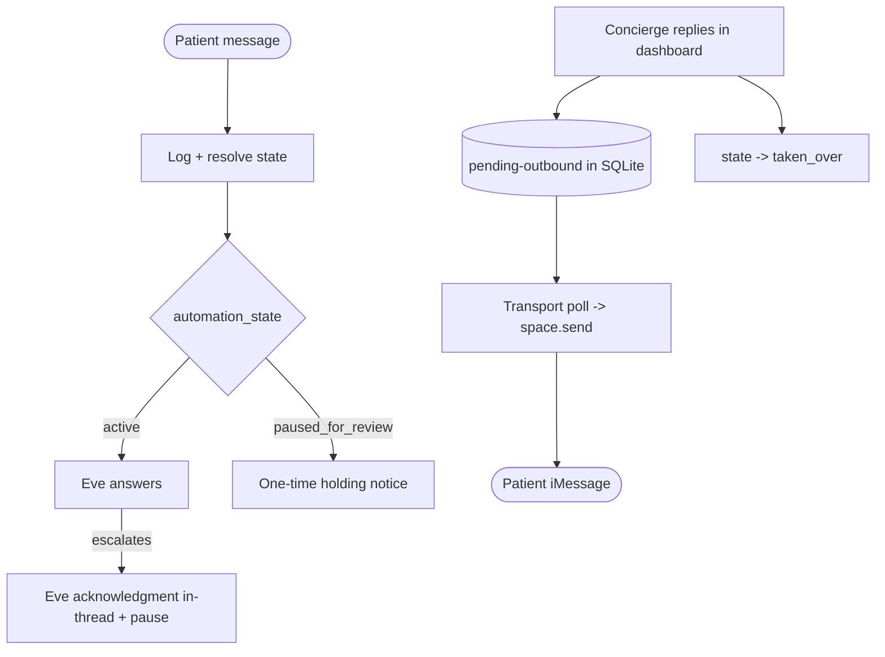

# Excellent escalation & handoff UX (patient + concierge)

## Problem (product framing)

When Eve escalates, the conversation pauses for a human. Today that means the patient hits a wall of silence: their acknowledgment was being lost (a stream bug), and every follow-up text while paused returns nothing ([transport/src/core.ts](transport/src/core.ts) lines 106-113). Meanwhile the concierge can see the flag in the dashboard but has no way to actually reply to the patient from there. The escalation is a dead-end, not a handoff.

This is not a Spectrum bug. The transport log showed messages arriving and resolving correctly (`reason=paused_for_review`); the DB shows Eve correctly raised a `Med`/`medication_decision` escalation on `conv_03e9122688a1`. The system worked; the experience didn't.

## Decision

Make escalation a real, two-sided handoff:

1. The patient always knows what's happening (acknowledgment on escalation, a one-time "team is reviewing" notice if they keep texting, and they receive the human's replies in-thread).
2. The concierge closes the loop from the single pane of glass -- typing a reply in the dashboard sends it to the patient's iMessage and marks the conversation taken over.

## Phase 1 -- Patient-side in-thread feedback ([transport/src/core.ts](transport/src/core.ts))

- The escalation acknowledgment is required by the tool ([escalate_to_human.ts](eve-concierge/agent/tools/escalate_to_human.ts) line 25) and is now actually delivered thanks to the per-turn stream fix already applied to [transport/src/eveClient.ts](transport/src/eveClient.ts).
- Add a module-level dedup set next to `sessions` (line 29): `const holdingNotified = new Set<string>()`.
- Replace the silent `paused_for_review` branch (lines 108-110): on the first patient message after the pause, append an agent message and return a severity-aware holding notice (look up the open escalation's `level` via `listOpenEscalationsForConversation`); record the id in `holdingNotified`; on later messages while still paused, stay silent. Suggested copy: Med -> "Thanks for your message. I've shared this with the Essos care team and someone will follow up here shortly." High -> a more urgent, reassuring variant.
- Clear `holdingNotified.delete(conversation.id)` at the start of the active path (step 5) so a later re-escalation re-notifies.
- `taken_over` stays silent by default because the human's replies now reach the patient directly via Phase 2.

## Phase 2 -- Concierge -> patient reply bridge (the closed loop)

Two processes share only SQLite, but Spectrum lets the transport send into an existing DM: `const im = imessage(app); const user = await im.user(patient.handle); const space = await im.space(user); await space.send(text)` (per [.agents/skills/spectrum/spaces-and-users.md](.agents/skills/spectrum/spaces-and-users.md); DM (re)acquisition works in shared-pool mode).

- Shared ([shared/src/repo.ts](shared/src/repo.ts)): when a concierge message originates from the dashboard, store it with `meta_json` marking `{ outbound: "pending" }`. Add helpers: `listPendingOutbound()` (query `messages` where `role='concierge'` and `json_extract(meta_json,'$.outbound')='pending'`), and `markOutboundDelivered(messageId)` (set `$.outbound='sent'`). No schema migration needed -- reuses the existing `messages.meta_json` column ([shared/src/db.ts](shared/src/db.ts) line 86).
- Dashboard: add a reply box to the conversation page ([dashboard/app/conversations/[id]/page.tsx](dashboard/app/conversations/[id]/page.tsx)) wired to a new server action in `dashboard/app/actions.ts` that appends the concierge message (pending-outbound) and calls `markConciergeTakeover` so Eve stays paused. Mirrors the existing `features/conversations/escalation-actions.tsx` pattern.
- Transport: add a poll loop (every ~3s) in a new `src/outbound.ts` started from [transport/src/imessage.ts](transport/src/imessage.ts). For each pending row, resolve the conversation -> patient handle, `space.send(text)`, then `markOutboundDelivered`. Idempotency: mark delivered immediately after a successful send and dedup on message id so a transport restart won't double-send.

## Phase 3 -- Dashboard waiting visibility

In `features/conversations/flags-panel.tsx` and the conversation list item, show "escalated Nm ago" (from the escalation `created_at`) and a count of patient messages since the last `agent`/`concierge` reply (derive from `listMessages`). This gives the concierge an at-a-glance SLA signal without new tables.

## Phase 4 -- Documentation (ADR)

- New `.docs/decisions/010-handoff-patient-feedback-ux.md`: the problem (silent handoff), root cause (paused = silent by design + the multi-turn stream-replay bug that hid the acknowledgment), the decision (patient acknowledgment + one-time holding notice + concierge->patient dashboard bridge + waiting visibility), the UX rationale for both sides, and consequences/trade-offs (polling latency, idempotency, shared-pool single-line constraint).
- Update [.docs/decisions/003-human-handoff-and-takeover.md](.docs/decisions/003-human-handoff-and-takeover.md) to reference 010 and note the configured acknowledgment + bridge.
- Add row 010 to [.docs/decisions/README.md](.docs/decisions/README.md) and update the README handoff/demo section ([README.md](README.md) lines 86-111).

## Phase 5 -- Resume, verify, clean up

- Resume the paused Diego conversation `conv_03e9122688a1` (resolve + resume via dashboard or `resumeAutomation`/`resolveEscalation` in [shared/src/repo.ts](shared/src/repo.ts)).
- Restart the transport. From Razi's phone (`647-221-5381` -> `628-264-9335`): hotel question (active), ibuprofen (acknowledgment + flag + pause), a follow-up (one holding notice), another follow-up (silent), then reply from the dashboard reply box and confirm it arrives on the phone and flips to taken_over; finally Resume Eve and confirm Eve answers again.
- Run `pnpm --filter @essos/transport run typecheck` + `test`, `pnpm --filter @essos/shared run build`, and `pnpm --filter @essos/dashboard run build`.
- Revert the temporary `[inbound]`/`[result]` debug logging in [transport/src/imessage.ts](transport/src/imessage.ts).

## Out of scope
- Fixing Maya's shared-pool line (separate Spectrum enrollment/support task); we continue on Razi's working line.
- The full five-stage debounce/queue pipeline from the best-practices skill (production hardening beyond this demo).
- Proactive outbound on resume (a "we're all set" auto-message) -- the bridge already lets a human send that manually.
