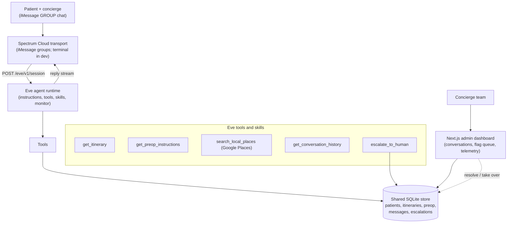

# Essos AI Health Tourism Concierge — Work Trial MVP

## What the `.context` tells us (synthesis)

From the [intro transcript](.context/worktrial_intro_full_meeting_transcript.md), [whiteboard](.context/whiteboard_cx_agent_architecture.md), [scenarios](.context/example_questions_and_scenarios), [itinerary](.context/example_itineraries.md), and [summary](.context/developing_ai_concierge_for_international_patients.md):

- **Goal:** a text-based concierge agent that joins the patient↔concierge group chat and autonomously handles **low-severity** questions at any hour, with a **human escalation path** for high-stakes cases (the "2am disappeared driver" story).
- **Beachhead:** rhinoplasty (primary) + hair transplant patients, Turkey & Mexico.
- **Autonomous-OK:** travel/logistics, itinerary Q&A (source of truth), pre-op *reference* answers (not clinical judgment), local recommendations (Google Places).
- **Must escalate:** any medical/clinical judgment, post-op symptoms, "unsure" / low-confidence, out-of-package requests.
- **Single pane of glass:** Varun explicitly wants visibility into what every agent is doing across all patients, plus "trip wires" that flag strange conversations.
- **Privacy:** ZDR API keys already negotiated; notional patient data only; scrappy/local build is acceptable.

## Transport decision: Spectrum (Cloud mode) over Sendblue

Both can reach iMessage, but the two features that matter most for Essos decide it:

- **Group chat** (core — the agent joins the existing patient↔concierge thread): Spectrum treats groups as first-class (`space.type: "dm" | "group"` narrowing; create/rename/manage participants/icons, plus reactions, typing, and threaded replies *inside* groups in cloud mode). Sendblue's group API is **beta, plan-gated, can't be created by AI-agent lines, and has no typing indicators in groups**.
- **Mini-app cards** (the rich UX you want): Spectrum's `customizedMiniApp()` renders native iOS-style cards (caption/subcaption/image/deep link, mirroring Apple's `MSMessageTemplateLayout`). Sendblue has no equivalent (only image carousels + tapbacks).

Caveats baked into the plan:
- Rich features (mini-app cards, group creation, group typing/reactions) require Spectrum **Cloud or dedicated** mode; **local mode is text + attachments only**. So the transport runs through **Spectrum Cloud**, while the agent, DB, and dashboard still run locally (the bridge connects out over gRPC). ZDR/privacy posture is preserved because inference stays on the ZDR-keyed model; Spectrum only moves message transport.
- Mini-app cards need a **published iMessage extension** (`extensionBundleId` + `teamId`, Apple developer setup) → treated as a **stretch goal**, not MVP-critical.

## Target architecture



- **Eve = brain**, **Spectrum Cloud = transport**, connected cleanly via Eve's HTTP session API. The Spectrum provider stays swappable (terminal provider for dev, iMessage for the live demo).
- **Group-chat-native:** the agent lives inside the patient↔concierge iMessage group. It answers low-severity questions in-thread; on escalation it pings the human concierge in the same group (e.g., "@team flagging this for you") AND raises a High/Med flag in the dashboard. Spectrum `space.type` narrowing distinguishes group vs DM.
- **One shared SQLite file** (`better-sqlite3`) is the source of truth for notional data, read/written by the agent and dashboard. Agent + DB + dashboard run locally; only iMessage transport goes through Spectrum Cloud.

## Repo layout (greenfield monorepo)

```
AI Health Tourism Concierge/
├── package.json            (pnpm workspace root)
├── agent/                  (Eve project: instructions, agent.ts, tools, skills, channels)
├── transport/             (Spectrum bridge: iMessage/terminal -> Eve session API)
├── dashboard/             (Next.js admin app)
├── shared/                (db schema, types, seed data, place/itinerary helpers)
└── .context/             (existing source material)
```

## Phase 1 — Foundation & shared data

- pnpm workspace + TypeScript across `agent`, `transport`, `dashboard`, `shared`.
- `shared/db.ts`: `better-sqlite3` with tables `patients`, `itineraries` (flight/clinic/hotel/follow-up/pre-op blocks), `preop_instructions`, `conversations`, `messages`, `escalations` (level High/Med, reason Medical/Unsure/OutOfScope, status open/resolved, assignee).
- `shared/seed.ts`: load the real example itinerary + rhinoplasty pre-op from `.context`, plus 2-3 Claude-generated notional patients (one Turkey rhinoplasty, one Mexico hair transplant) so the demo has variety.

## Phase 2 — Eve agent (the brain)

- `agent/instructions.md`: persona ("Essos concierge"), the **escalation policy** (source-of-truth hierarchy: itinerary + pre-op = answer; post-op/medical = escalate; unsure = escalate), tone, and the rule that pre-op answers must quote documented instructions, never give clinical judgment.
- `agent/agent.ts`: `defineAgent` with model via the provided ZDR API key (AI Gateway / Anthropic).
- `agent/tools/`:
  - `get_itinerary.ts`, `get_preop_instructions.ts`, `get_conversation_history.ts` (read patient context from SQLite)
  - `search_local_places.ts` (Google Places API for restaurants/pharmacies/ATMs)
  - `escalate_to_human.ts` (writes an `escalations` row with level + reason; this is the trip wire)
  - `update_logistics.ts` (notional: e.g., "notify driver of new pickup time")
- `agent/skills/`: `handle_travel_disruption.md`, `answer_preop_reference.md`, `recommend_local.md`, `triage_and_escalate.md` (the monitor logic that classifies severity before responding).
- `agent/channels/eve.ts`: default HTTP session API (already provided by Eve) — this is what Spectrum calls.

## Phase 3 — Spectrum transport bridge

- `transport/index.ts`: `Spectrum({ providers: [...] })` consuming `app.messages`; for each message resolve the patient by `space` (group) / `user` handle, `POST /eve/v1/session` (or resume with continuation token), stream Eve's reply, and `space.send(...)` / `message.reply(...)` back into the group thread. Use `space.responding(...)` so the patient sees the typing indicator while Eve composes.
- Narrow on `space.type === "group"` to map an iMessage group to a patient/conversation record, and only auto-respond to patient turns (ignore the human concierge's own messages in-thread).
- Start with `spectrum-ts/providers/terminal` for fast local iteration; swap to `spectrum-ts/providers/imessage` in **Spectrum Cloud mode** for the live group-chat demo (provisions credentials in minutes). Burner number used to play the patient.
- **Stretch (wow factor):** use `customizedMiniApp(...)` to render rich cards — e.g., an itinerary summary card, a "confirm new pickup time" card, or an escalation-status card. Gated on having an Apple iMessage extension (`extensionBundleId` + `teamId`); if unavailable, fall back to formatted text + tapback reactions.

## Phase 4 — Admin dashboard (single pane of glass)

- Next.js (App Router) reading the shared SQLite store:
  - **Conversations** list with per-patient threads and live message view.
  - **Escalation / flag queue**: High/Med, reason, jump-to-conversation, resolve / "take over" actions.
  - **Patient + itinerary viewer**: timeline of flight/clinic/hotel/follow-up + pre-op.
  - **Agent telemetry**: turns handled autonomously vs escalated, response counts (link out to Eve's Vercel Agent Runs view for token/tool detail).

## Phase 5 — Demo scenarios & polish

- Scripted runs through canonical cases from `.context`: itinerary lookup ("what's my reservation number?"), flight-delay → update driver, pre-op reference ("when do I stop eating?"), local rec ("where to eat near the hotel"), and **escalation** cases ("is this swelling normal?", disappeared driver) showing High/Med flags surfacing in the dashboard.
- README with setup, the assumptions made (per Varun's "have a reason for each assumption"), and product notes on scope/remit.

## Key assumptions (to document)

- iMessage primary surface (American patients), group chat the primary space; terminal provider for dev.
- **Spectrum (Cloud mode) over Sendblue** — chosen for first-class group chat + native mini-app cards; rationale documented above.
- Notional data only; SQLite local store; agent + DB + dashboard run locally, only iMessage transport via Spectrum Cloud (ZDR preserved since inference stays on the ZDR-keyed model).
- Pre-op = answerable reference; post-op/medical = always escalate.
- Eve and Spectrum integrate via HTTP, keeping transport swappable.
- Mini-app cards are a stretch goal (require an Apple iMessage extension); MVP delivers rich text, tapbacks, typing, and in-group escalation.

## Open questions for later (non-blocking)

- Whether to deploy Eve to Vercel (durable sessions, Agent Runs dashboard) vs keep fully local for the trial. Default: local for the demo, note the one-step path to Vercel.
- Whether an Apple developer account / iMessage extension is available for the mini-app card stretch goal.