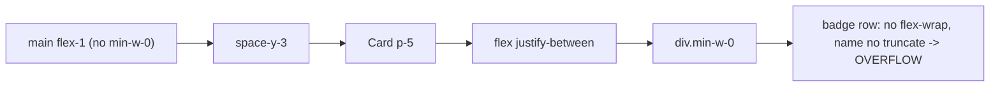

# Essos Dashboard: S-Tier Design System & Motion Pass

## Goals
- Kill the right-side overflow on conversation cards (real layout bug).
- Turn the ad-hoc Tailwind utilities into a coherent, documented design system: tokens for color, elevation, spacing rhythm, radii, typography, and **motion** (easing curves + durations).
- Add a thin, reduced-motion-aware animation layer (hover lift, press feedback, list/stagger entrances) using `motion` (Framer Motion) for dynamic/interruptible motion and CSS for predetermined motion — exactly the split both skills recommend.
- Preserve the intentional brand (warm cream `#f5f1e5`, off-white cards, Georgia serif headings, classic `#0000ee` blue). Refine within it; do not redesign the identity.

## 1. Root cause of the overflow
Layout chain: `app/layout.tsx` `<main className="flex-1 px-6 py-8 md:px-10">` has **no `min-w-0`** (a `flex-1` child defaults to `min-width:auto`, so wide content refuses to shrink), and `features/conversations/conversation-list-item.tsx` has a badge/name row that is `flex items-center gap-2` with **no `flex-wrap`** and a non-shrinking `font-semibold` name. A long name + "Human handling" + "N open flags" + "patient waiting" exceeds the column and pushes the card past the viewport.

Fixes:
- `app/layout.tsx`: `<main>` gets `min-w-0` + an `overflow-x` guard, and a centered max-width content wrapper (`mx-auto w-full max-w-[var(--w-content)]`) so the dashboard reads as a designed column instead of full-bleed.
- `conversation-list-item.tsx`: badge row -> `flex flex-wrap items-center gap-x-2 gap-y-1`; patient name -> `min-w-0 truncate`; keep the `min-w-0` on the left column.

## 2. Token + motion foundation
Edit `dashboard/app/styles/tokens.css` and `dashboard/app/globals.css`.

- **Motion tokens** (new) in `@theme`, so they generate `ease-*`/`duration-*` utilities:
  - `--ease-out: cubic-bezier(0.23, 1, 0.32, 1);`
  - `--ease-in-out: cubic-bezier(0.77, 0, 0.175, 1);`
  - `--ease-drawer: cubic-bezier(0.32, 0.72, 0, 1);`
  - durations: `--duration-fast: 140ms; --duration-base: 200ms; --duration-slow: 260ms;` (all sub-300ms per the standards).
- **Elevation**: replace the single flat `--shadow-card` with a layered ramp (`--shadow-sm`, `--shadow-card`, `--shadow-card-hover`, `--shadow-pop`) using stacked low-alpha shadows for real depth.
- **Borders**: add a dedicated `--color-border` (hairline) instead of reusing `secondary/60` everywhere, for consistent 1px lines.
- **Spacing rhythm + width**: add `--w-content` (e.g. `1100px`) and standardize page vertical rhythm.
- **Typography**: load a proper UI typeface via `next/font` (e.g. Inter) for `--font-sans` while keeping Georgia/serif for the brand headings; tighten heading tracking. (Keeps the look, sharpens the text.)
- **globals.css**: add a global reduced-motion block, refine `.focus-ring`, and add a `@media (hover:hover)` gate utility for hover-only motion.

## 3. Thin motion layer (new)
Add `motion` (Framer Motion) — established, ~well-known, tree-shakeable.
- New `dashboard/components/motion/stagger-list.tsx`: a small `"use client"` wrapper using `motion` + `useReducedMotion` that fades/translates children in with a 40-60ms stagger (`opacity 0->1`, `translateY 8px->0`, `--ease-out`, `--duration-base`). Reused by the conversations list and the escalation queue.
- Prefer CSS `@starting-style` for one-shot entrances where supported; `motion` only for list orchestration and interruptible motion. No animation on keyboard/high-frequency actions.

## 4. Component polish (CSS-first, all sub-300ms, GPU-only)
- `components/ui/card.tsx`: interactive cards lift on hover (`transform: translateY(-2px)` + `--shadow-card-hover`, gated behind `@media (hover:hover)`), `transition: transform/box-shadow var(--duration-base) var(--ease-out)`, and `active:translate-y-0` for press feedback. Replace `transition` (which is `all`) with explicit properties.
- `components/ui/button.tsx`: add `:active { transform: scale(0.97) }` with `transition: transform var(--duration-fast) var(--ease-out)`; keep focus-ring; explicit transition props.
- `components/ui/badge.tsx` + automation/level/status badges: add an optional leading status **dot** for instant scannability, consistent pill padding, and align all badge backgrounds to the soft-tint tokens.
- `components/layout/nav-link.tsx`: animated active indicator (a left accent bar or `motion` layout pill via `layoutId`) instead of a plain bg swap; explicit transition.
- `features/conversations/message-bubble.tsx`: subtle entrance + clearer role differentiation (alignment/:first spacing); keep colors token-driven.
- Inputs in `concierge-reply-box.tsx`: unify border/focus tokens, refined focus ring.
- `app/loading.tsx`: align skeletons to the new radii/shadow tokens and `--w-content` so the loading state matches the real layout.

## 5. Page-level application
- `app/conversations/page.tsx`: wrap list in `StaggerList`.
- `app/page.tsx` (Overview): wrap `TelemetryStats` cards and `EscalationQueue` items in `StaggerList`; verify the `escalation-queue.tsx` rows (already `flex-wrap`) match the new badge/spacing system.
- `app/conversations/[id]/page.tsx`: tighten the `lg:grid-cols-[1fr_320px]` rhythm against the new spacing tokens; ensure `min-w-0` on the thread column.

## 6. Accessibility & verification
- Honor `prefers-reduced-motion` everywhere (drop transforms, keep opacity) via the global CSS block + `useReducedMotion` in the motion layer.
- Gate all hover motion behind `@media (hover: hover) and (pointer: fine)`.
- Run `npm run typecheck` in `dashboard/`, start `next dev --port 4000`, and visually verify: no horizontal overflow at narrow + wide widths, card hover/press, list stagger, focus rings, and reduced-motion.

## Notes / decisions
- Keeping the existing Essos brand palette and serif headings (intentional, "extracted from essos.com"); this pass refines spacing, elevation, motion, and consistency rather than restyling the identity.
- `motion` is the one new dependency; everything else is Tailwind v4 tokens + CSS. If you'd rather stay zero-deps, the stagger layer can fall back to pure CSS `@starting-style` + `nth-child` delays.