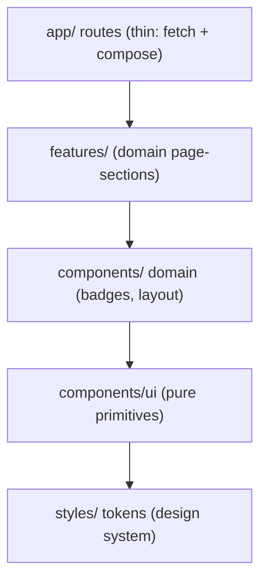

# Essos Dashboard S-Tier Modularization

Keep the stack (Next 16 App Router, React 19, Tailwind v4, direct `@essos/shared` server reads). The work is purely about structure, the design system, and a light polish pass. Nothing in the data layer or routing behavior changes.

## Architecture: four clean layers

Rule: a file imports only from layers below it. Pages never define markup beyond layout + composition. Target file sizes: primitives under ~40 lines, feature sections under ~80, pages under ~50.

## Target structure

- `dashboard/app/styles/tokens.css` - the `@theme` design tokens, reorganized and extended (extracted from `globals.css`).
- `dashboard/app/globals.css` - thin: `@import "tailwindcss"`, `@import "./styles/tokens.css"`, base resets + `.serif`.
- `dashboard/components/ui/` - domain-agnostic primitives, one per file + `index.ts` barrel: `badge.tsx` (base `Pill`/`Badge`), `card.tsx`, `button.tsx`, `stat.tsx`, `page-header.tsx`, `definition-row.tsx` (today's `Row`).
- `dashboard/components/badges/` - domain badges built on `Badge`, enum-to-style maps colocated: `level-badge.tsx`, `status-badge.tsx`, `automation-badge.tsx`, `policy-badge.tsx`, `index.ts`.
- `dashboard/components/layout/` - `sidebar.tsx`, `nav-link.tsx` (client, `usePathname` for an active state).
- `dashboard/features/overview/` - `telemetry-stats.tsx`, `escalation-queue.tsx`.
- `dashboard/features/conversations/` - `conversation-list-item.tsx`, `message-thread.tsx` + `message-bubble.tsx` (owns the `ROLE_STYLES` map), `patient-summary-card.tsx`, `flags-panel.tsx`, `activity-log.tsx`, `escalation-actions.tsx` (the client component, moved out of `app/conversations/[id]/`).
- `dashboard/features/patients/` - `itinerary-timeline.tsx`, `care-instructions.tsx` + `care-row.tsx`, `source-documents.tsx`.
- `dashboard/lib/format.ts` - keep.
- `dashboard/lib/labels.ts` - shared `ROLE_LABEL` (and any other cross-feature label maps).
- `dashboard/lib/actions.ts` - the three Server Actions (moved from `app/actions.ts`) so features import a stable `@/lib/actions` path.

`lib/ui.tsx` is deleted; its contents are split across `components/ui` and `components/badges`.

## What moves where

- `lib/ui.tsx` -> `Pill`->`components/ui/badge.tsx`; `Card`/`Button`/`Stat`/`PageHeader`/`Row` -> `components/ui/*`; `LevelBadge`/`StatusBadge`/`AutomationBadge`/`PolicyBadge` -> `components/badges/*`; `CareRow` -> `features/patients/care-row.tsx`; `ROLE_LABEL` -> `lib/labels.ts`.
- `app/page.tsx` (95) -> thin shell importing `TelemetryStats` + `EscalationQueue` from `features/overview`. Removes the cross-route import noted below.
- `app/conversations/[id]/page.tsx` (164) -> thin shell composing `MessageThread`, `PatientSummaryCard`, `FlagsPanel`, `ActivityLog`. The local `ROLE_STYLES` map moves into `message-bubble.tsx`.
- `app/conversations/page.tsx` -> uses `ConversationListItem`.
- `app/patients/[id]/page.tsx` (136) -> thin shell composing `ItineraryTimeline`, `CareInstructions`, `SourceDocuments`.
- `app/conversations/[id]/escalation-actions.tsx` -> `features/conversations/escalation-actions.tsx`. This removes the current smell where `app/page.tsx` reaches into a route-specific file (`import { EscalationActions } from "./conversations/[id]/escalation-actions"`).
- `app/actions.ts` -> `lib/actions.ts`.

## Design-system token refinement (`styles/tokens.css`)

Keep the Essos brand values; organize and extend the `@theme` block into labeled groups, all as proper tokens so they generate utilities:
- Brand + neutrals (surface, card, ink, primary, secondary, muted) - unchanged values, grouped.
- Semantic status (high/med/ok + soft variants) - grouped, keep values.
- Add `--shadow-card` and `--shadow-card-hover` (subtle elevation) and a `--ring` focus token.
- Add `--font-sans` / `--font-serif` as theme tokens (currently hardcoded in `globals.css`/`.serif`).
- Add a small radius set alongside existing `--radius-card`.

## Polish pass (no redesign)

- `Button`, `nav-link`, and link styles get `focus-visible` rings (token-driven) for accessibility.
- `Card` gains an optional `interactive` prop applying hover elevation/border via the new shadow tokens; conversation list items and the escalation queue use it.
- `Sidebar` active-route highlight via the new client `nav-link.tsx`.
- Consistent transitions and spacing rhythm sourced from tokens.
- Stays light-only; no dark mode, no layout/IA changes.

## Verification

- `pnpm dashboard:dev` (port 4000) renders Overview, Conversations, thread, and patient pages identically (plus the polish), with working take-over / resolve / resume actions and the source-doc route.
- TypeScript: `tsc --noEmit` clean; no remaining imports of `@/lib/ui` or `./actions` from the old paths.