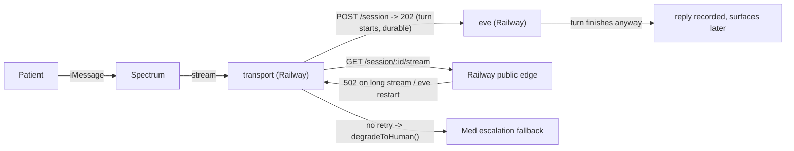

## Confirmed root causes (from deep investigation)

1. Prod transport streams from Eve over the public `*.up.railway.app` edge; long-lived stream + Eve cold-start/restart (sandbox template rebuild) => intermittent 502. `transport/src/eveClient.ts:256-258` throws on the first 502, `transport/src/core.ts:299-320` immediately `degradeToHuman`. POST already returned 202 so Eve finishes durably => "real reply later". This is the whole "everything escalates" symptom.
2. `Escalations.resolve` (`convex/model/escalations.ts:119`) never sets `automation_state` back to `active`; the holding-notice latch (`transport/src/core.ts:244-254`) then drops all later patient messages => silent black hole until manual Resume.
3. No patient-triggered resume exists anywhere.
4. Single-instance lock is host-local (`transport/src/singleInstance.ts:16`) => local + Railway transports fight one Spectrum project => watchdog `process.exit(1)` flapping + Spectrum "agent isn't online" gaps.
5. UX: resolve/take-over/resume scattered in Flags panel + header, not the reply area; no combined resolve+resume.
6. Error-swallowing `.catch(() => {})` in `transport/src/core.ts` (127, 271, 313, 322, 339, 383) + degrade try/catch hide real failures.
7. Config gaps: prod transport missing `ESSOS_CONCIERGE_HANDLES`; `EVE_BASE_URL` public; `ESSOS_GUEST_TEMPLATE` not threaded to `ensureGuest`; committed secrets in `.env`/`.env.local`.

---

## Phase 1 - Fix prod transport->Eve 502 (private networking + retry) [decision A+C]

- Investigate first (C): pull deeper Railway eve logs around restart timestamps to confirm OOM vs redeploy vs cold-start; check eve memory limits and whether `eve start` binds the Railway `$PORT` (logs show :8080).
- Pin Eve's port and bind: ensure `eve-concierge` start uses Railway `$PORT` consistently; confirm it listens on all interfaces for private networking.
- Switch the hop to private networking: set the transport service `EVE_BASE_URL` to the eve private domain (`http://<eve RAILWAY_PRIVATE_DOMAIN>:<PORT>`) via Railway CLI, using the existing `RAILWAY_SERVICE_EVE_URL`/`RAILWAY_PRIVATE_DOMAIN` reference. Keep `ESSOS_TRANSPORT_SECRET` as defense-in-depth.
- Add bounded stream retry/reconnect in [transport/src/eveClient.ts](transport/src/eveClient.ts): on a non-2xx stream GET (esp. 502/503/504) or premature stream close before `turn.completed`, reconnect using the route's `startIndex` resume (the GET route supports it) with capped exponential backoff (e.g. 3 attempts). Only `degradeToHuman` after retries are exhausted, so a transient edge blip never escalates.
- Keep the durable-session advantage: on reconnect, replay from `startIndex` so the already-running turn's events are picked up (this also recovers the "late reply" into the same turn instead of a ghost).

## Phase 2 - Repair escalation lifecycle (code)

- Make Resolve restore service: in [convex/model/escalations.ts](convex/model/escalations.ts) `resolve()`, when no other open escalations remain for the conversation, set `automation_state` back to `active` (resolve implies "handled, Eve can resume") OR introduce an explicit resolve+resume path used by the new UI (see Phase 4). Decision baked in: resolve alone returns the conversation to `active` unless it was an explicit human `taken_over` that should stay manual.
- Fix the holding-notice black hole: in [transport/src/core.ts](transport/src/core.ts) anchor the `handoff_holding` latch to the latest pause event, not "any holding notice ever", so a re-pause after resume re-notifies and a resumed conversation answers normally.
- Ensure `markConciergeTakeover` only sets `taken_over` when there is genuine human takeover (avoid pausing on no-op loops).

## Phase 3 - Patient self-serve resume ("pls resume")

- Add inbound patient command parsing in [transport/src/pipeline.ts](transport/src/pipeline.ts) / [transport/src/core.ts](transport/src/core.ts): when a conversation is `paused_for_review`/`taken_over` and the patient message matches a resume intent (e.g. /^\s*(pls\s+)?resume\b/i plus a couple of synonyms), call a new shared `resumeAutomation` machine path, resolve any open escalations, post a short "you're back with Eve" confirmation, and let the same message fall through to a normal Eve turn.
- Expose a machine-path mutation for transport-driven resume in [convex/machine.ts](convex/machine.ts) (service-secret guarded), reusing `resumeAutomation` + `Escalations.resolve` model fns.

## Phase 4 - Dashboard + Slack UX for resolve/resume/takeover

- Reply-area actions: in [dashboard/features/conversations/concierge-reply-box.tsx](dashboard/features/conversations/concierge-reply-box.tsx), when the conversation is escalated/paused, render an action row in the reply footer: "Resolve", "Resolve + Resume Eve" (primary), and "Take over" - co-located with the input so the concierge acts in one place. Pass `automationState`/`openEscalation` down from [dashboard/features/conversations/conversation-detail-view.tsx](dashboard/features/conversations/conversation-detail-view.tsx).
- Add a `resolveAndResume` public mutation in [convex/mutations.ts](convex/mutations.ts) (Clerk-gated) so "Resolve + Resume Eve" is one atomic action; keep separate Resolve/Resume for granular control.
- Keep the Flags panel actions but make state obvious; ensure the header Resume button and reply-area stay in sync via the single `automation_state` source.
- Slack parity: the card already has Take over / Resolve / Resume Eve ([slack/src/blocks.ts](slack/src/blocks.ts)); add a "Resolve + Resume" action mapping to the same new path so Slack and dashboard match.

## Phase 5 - Remove error-hiding defensive code

- In [transport/src/core.ts](transport/src/core.ts) remove `.catch(() => {})` swallows (lines ~127, 271, 313, 322, 339, 383) and the broad degrade try/catch (109-121). Let telemetry/append failures surface (logged via `debug` with the real error, or rethrow) rather than silently dropping. Keep try/catch only where it has a real role: the abort-signal branch (TurnAbortedError), and genuinely best-effort typing indicator (but log on failure).
- Audit [transport/src/eveClient.ts](transport/src/eveClient.ts) `reader.cancel().catch(() => {})` and `postJson` `res.text().catch(() => "")` - keep only where cancellation/empty-body is legitimately ignorable; otherwise surface.
- Do NOT touch try/catch that sanitizes external/unknown input (Spectrum payloads, JSON parse of ndjson lines).

## Phase 6 - Dev/prod separation + config hygiene

- Local iMessage workflow [decision: terminal-local]: document and enforce that local dev uses `pnpm transport:terminal` (no Spectrum); add a guard so a local `transport:imessage` refuses to start unless an explicit `ESSOS_ALLOW_LOCAL_IMESSAGE=1` is set, with a clear message that it will fight the Railway transport. Update README Run/Runbook accordingly.
- Fill prod transport gaps via Railway CLI: set `ESSOS_CONCIERGE_HANDLES`, confirm `ESSOS_GUEST_MODE`, and thread `ESSOS_GUEST_TEMPLATE` through `ensureGuestPatient`/`ensureGuest` ([convex/model/patients.ts](convex/model/patients.ts)) so it is honored (currently always clones pat_maya).
- Secret hygiene: confirm `.env`, `.env.local`, `dashboard/.env.local` are gitignored and not in history; flag rotation of the committed Anthropic/Spectrum/Slack/Vercel-OIDC values (do not print values). Keep `dashboard/.env.local` local Convex URL fix already applied.
- Leave `ESSOS_DEMO_MODE`/`ESSOS_GUEST_MODE` on and `ESSOS_REQUIRE_AUTH` off for the trial demo (documented intentional), but note the prod hardening switch.

## Phase 7 - Reset state + verify end-to-end

- Clean slate for fresh testing: clear stale guest patients (`pat_guest_*`) and their conversations, and reset Diego's conversation state, in both local and prod Convex (gated by `ESSOS_ALLOW_SEED`; use `pnpm seed:reset` locally and the documented prod reseed). This removes any "stuck" `paused_for_review`/`taken_over` rows from earlier 502 escalations.
- Local verification: `pnpm dev` + `pnpm transport:terminal`; run the demo scenarios (hotel reservation, pre-op fasting, swelling -> escalation, "pls resume" -> resumes), confirm no false 502 escalations and that resolve/resume/takeover behave in UI.
- Prod verification: redeploy transport + eve with private `EVE_BASE_URL` and retry, re-pull Railway logs to confirm no 502/restart flapping, then text the Spectrum number from a single device and confirm a real Eve reply lands in iMessage + dashboard + Slack, and "pls resume" works.
- Typecheck/build all packages (`pnpm typecheck`) and the transport unit tests for the new retry logic.

## Notes / decisions baked in

- Eve hop: Railway private networking + transport-side stream retry/reconnect (decision A), preceded by a Railway-log root-cause pass (decision C).
- Local iMessage uses terminal transport; iMessage exercised only via prod, with a guard to prevent accidental local Spectrum contention.
- "Resolve" returns automation to active (so a resolved thread is not a silent black hole); explicit human takeover stays manual until Resume/Resolve+Resume.