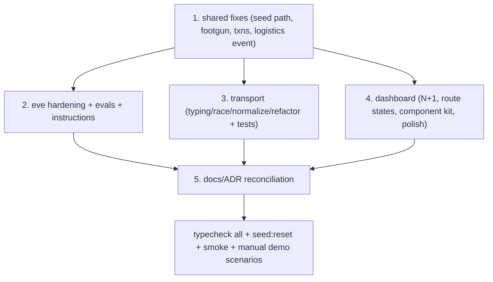

# Essos S-Tier Cleanup

A full-codebase quality pass driven by a deep review of all four packages against the Eve docs (`eve-concierge/node_modules/eve/docs/`), the `spectrum-ts` API, Next.js App Router best practices, and the 8 ADRs. Defaults chosen (questions skipped): production-grade hardening **now**, and a real dashboard component-kit refactor + tasteful polish (keep current IA).

Work is grouped by package. Within each, items are ordered correctness → hardening/best-practice → stubs/dead-code → structure/cleanliness → docs.

## 1. Eve agent (`eve-concierge/`)

Reviewed in [audit transcript](d5f021f5-d1b0-4965-bd5a-917b6b754d62).

- **Harden the default harness (security).** Only `web_search` is disabled today. Add `disableTool()` sentinels (same pattern as [agent/tools/web_search.ts](eve-concierge/agent/tools/web_search.ts)) for `bash`, `read_file`, `write_file`, `glob`, `grep`, `web_fetch` — a patient-injection payload could otherwise exfiltrate `process.env` via `web_fetch`. Then delete the standing "Built-in tool hardening (follow-up)" section from [eve-concierge/README.md](eve-concierge/README.md).
- **Replace `placeholderAuth()`.** [agent/channels/eve.ts](eve-concierge/agent/channels/eve.ts) ships the untouched `eve init` scaffold that returns 401 in prod. Swap for a real auth strategy (shared-secret header from the transport) so the deployed session API is reachable.
- **Narrow `escalate_to_human` enum.** [agent/tools/escalate_to_human.ts](eve-concierge/agent/tools/escalate_to_human.ts) builds its `reason` enum from `ALL_CATEGORIES`, allowing nonsensical escalations on autonomous-only categories. Restrict to the `autonomous: false` categories (+ `travel_logistics`).
- **PII minimization.** Add `outputSchema`/`toModelOutput` (or field-level redaction) to tools returning sensitive data — [get_itinerary.ts](eve-concierge/agent/tools/get_itinerary.ts) returns raw `driver_phone`/`confirmation_number` into model context.
- **Resolve the evals wiring (chosen: build it).** `package.json` `#evals/*` import and `tsconfig.json` `evals/**` include point at a non-existent dir. Author a small real `evals/` suite covering the 6 README demo scenarios (autonomous answer vs escalation), wiring the existing `#evals/*` subpath.
- **De-dupe patient profile shape.** [get_itinerary.ts](eve-concierge/agent/tools/get_itinerary.ts) returns a `patient` sub-object overlapping `get_patient_overview` (and drifting: no `dietary_notes`). Drop the overlap; let `get_patient_overview` own the profile.
- **Instructions fix.** Add `get_patient_overview` to the source-of-truth hierarchy in [agent/instructions.md](eve-concierge/agent/instructions.md) (its own description says "call this first" but the prompt never lists it). Unify context-block naming across tool descriptions (`ESSOS_CONTEXT block` everywhere, not "context block").
- **Model logistics event properly.** [update_logistics.ts](eve-concierge/agent/tools/update_logistics.ts) logs under `event: "message"`; add a dedicated `logistics` activity event in the shared taxonomy/types and use it (keeps the audit log honest; still a notional MVP action).

## 2. Spectrum transport (`transport/`)

Reviewed in [transport audit](88673bfc-42e9-42c8-9da2-97afcb9de0ac).

- **Typing-indicator on silent turns (UX bug).** `space.responding(...)` wraps the *entire* `handleInbound` call in both [imessage.ts](transport/src/imessage.ts) and [terminal.ts](transport/src/terminal.ts), so a typing indicator shows even when Eve will stay silent (concierge messages, paused/taken-over threads). Compute the result first; only wrap the actual reply send.
- **Stream-open race.** [eveClient.ts](transport/src/eveClient.ts) POSTs (starting the turn) then opens `GET /stream` — events emitted in between are lost → empty reply. Open the stream before/concurrently, or document+test Eve's replay guarantee.
- **Handle normalization.** Patient binding and concierge detection use exact string equality ([core.ts](transport/src/core.ts), [imessage.ts](transport/src/imessage.ts)). Normalize (lowercase email, canonicalize E.164) before matching.
- **Surface silent failures.** Log (under `ESSOS_DEBUG`) when `contentToText` drops non-text content ([contentText.ts](transport/src/contentText.ts)) and when `collectReply` resolves empty, distinguishing "model said nothing" from "parse miss."
- **`dotenv` → `dependencies`.** It's a runtime import in [env.ts](transport/src/env.ts) but declared under `devDependencies` in [transport/package.json](transport/package.json); breaks an isolated/prod install.
- **Make `collectReply` testable + test it.** Extract a pure `reduceEveEvents(events) → string` + line-splitter from the 90-line closure in [eveClient.ts](transport/src/eveClient.ts); add fixture-driven tests (multi-step tool-calls → final, `*.failed`, partial mid-line buffers). This is the most fragile code and has zero coverage.
- **De-dupe entrypoints.** Factor the shared `main()` loop into a `runLoop({ resolveAuthor, spaceIdPrefix, onResult })` helper; keep `imessage.ts`/`terminal.ts` thin.
- **Smoke harness hygiene.** [smoke.ts](transport/src/smoke.ts) writes accumulating rows with `terminal:smoke-${Date.now()}`; use an isolated/in-memory DB or teardown, and assert the uncovered `InboundResult` reasons.
- **Cleanup:** remove dead `CreateResponse.error` field, rename the reused `CreateResponse` for the continue path, name the magic `120000`/`120` literals.

## 3. Shared (`shared/`)

Reviewed in [shared/repo audit](e2d333aa-9623-4529-89bb-ce330b432239). This package is already strong (parameterized SQL, clean barrel, no stubs).

- **Fix stale seed path (must-fix).** [seed.ts](shared/src/seed.ts) fallback uses `output/pdf/essos/...`; should be `mock-assets/pdf/essos/...` — currently masked by the manifest but silently hashes Markdown instead of the PDF if the manifest is absent.
- **Fix spread-ordering footgun.** `insertCareInstruction` in [repo.ts](shared/src/repo.ts) spreads `...doc` *after* the generated `id` default (latent NULL-PK); match the safe pattern in `insertSourceDocument`.
- **Remove vestigial `migrateSchema`.** [db.ts](shared/src/db.ts) adds columns the canonical `SCHEMA` already declares — dead on a fresh DB.
- **Wrap multi-statement writes in transactions:** `seed.ts main()` and `markConciergeTakeover` in [repo.ts](shared/src/repo.ts).
- Add the `logistics` activity event to `types.ts`/`taxonomy.ts` (supports the Eve fix above).

## 4. Dashboard (`dashboard/`)

Reviewed in [dashboard audit](646a1330-ad1d-41f6-aa9b-04b4cb668b9d). Chosen scope: real component kit + correctness + tasteful polish, keep current IA.

- **Fix N+1 synchronous SQLite reads** in [app/page.tsx](dashboard/app/page.tsx) and [app/conversations/page.tsx](dashboard/app/conversations/page.tsx) (batch into single repo queries in `@essos/shared`).
- **Add route states.** Create `error.tsx`, `loading.tsx`, and `not-found.tsx` (currently `notFound()` is called with no boundary).
- **PDF route** ([app/source-docs/[id]/route.ts](dashboard/app/source-docs/[id]/route.ts)): either actually stream or fix the docstring/ADR/README that claim "streams"; guard the unguarded markdown fallback.
- **Metadata:** add per-page `generateMetadata`; load (or remove) the referenced-but-unloaded `.serif` brand font.
- **Build the component kit.** Promote ad-hoc inline `Stat`/`Row`/`CareRow` and button-style string constants into real primitives in [lib/ui.tsx](dashboard/lib/ui.tsx) (add a `Button`); replace the arbitrary `--radius-card` usage with the generated utility; unify styling (tailwind tokens over inline/hex). Do NOT add `"use client"` to [escalation-actions.tsx](dashboard/app/conversations/[id]/escalation-actions.tsx) — it correctly stays a Server Component.
- **Consistency + dead code.** Share one role-label map between the conversation list (raw roles) and the thread ("Eve"/"Patient") views; delete the dead `formatDate` export in [lib/format.ts](dashboard/lib/format.ts); extract hardcoded `ASSIGNEE`/port/hex constants.

## 5. Docs / ADRs reconciliation

- Standardize the tools count: "7 callable tools + 1 disabled built-in" across root [README.md](README.md), [eve-concierge/README.md](eve-concierge/README.md), and ADR 005.
- Update ADR 002 suggested schema to include `source_document_id`; update ADR 005 artifact list to include `.workflow-data/`/`.nitro/`; add those two to the root [.gitignore](.gitignore).
- Fix the PDF "streams" wording in ADR 007 + dashboard README + route docstring to match real behavior.
- Delete the stale model-slug note in `.cursor/plans/essos_fixes_and_dashboard_90b32c50.plan.md`.
- Reconcile the two PDF-generation entry points (`assets:generate` wrapper vs the Python script) in the mock-assets README.

## Suggested sequencing

Verification after each package: `pnpm typecheck` (all workspaces + agent), `pnpm seed:reset`, `pnpm --filter @essos/transport run smoke`, and a manual pass of the 6 README demo scenarios via `transport:terminal`.