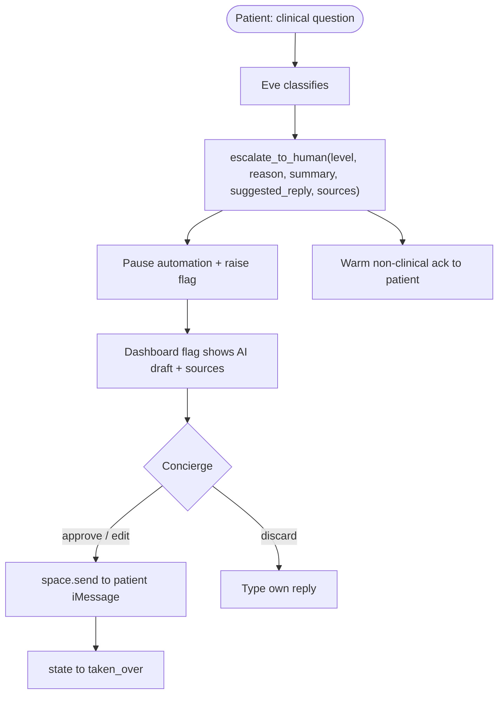

# Essos: patient + concierge UX excellence pass

Goal: ship a demo where the patient always feels held and informed, and the concierge moves fast from a single pane of glass. Three eve capabilities currently unused (HITL approval, schedules, durable state) become the backbone of the standout features. We will not treat the ADRs as fixed where they hold the UX back.

## Current state (caught up as of the last live-test session)

The two-sided handoff already shipped: [transport/src/outbound.ts](transport/src/outbound.ts) (3s poll, `space.send`), the `concierge-reply-box.tsx` (with an `agentName` field + auto-signature), `unansweredCount` + "waiting Nm" in the flags panel, the multi-turn `eveClient.ts` fix (`EveSession` now carries `turns` + `continuationToken`), and ADR 010 already exists. So this pass extends that work; it does not rebuild it.

Two pieces of live-test contamination are in the tree and must be reverted before any demo: `mock-assets/patients/diego-ramirez.json` is bound to a real phone number and `ESSOS_CONCIERGE_HANDLES=` is empty in `.env` (so concierge detection is currently off). Also note the port gotcha: `pnpm eve:dev` serves on 2000 but the transport calls `:3000` — launch Eve with `eve dev --no-ui --port 3000`.

## Forward-compatibility (Clerk + Convex, coming after this work)

- All new reads/writes go through `@essos/shared` repo helpers — no raw SQL in the dashboard or transport — so the SQLite layer can later be swapped for Convex in one place.
- New persisted fields stay plain and serializable (strings / JSON) so they map 1:1 onto Convex documents.
- No auth assumptions baked in now; the dashboard stays unauthenticated for the demo, but data access is centralized so a Clerk gate + Convex queries can wrap it later. The transport-side reminder loop is deliberately isolated so it can move to a Convex scheduled function.

## Centerpiece: escalation becomes a concierge "AI-assist" loop

Today escalation is a safe dead-end: Eve flags, pauses, goes quiet; the concierge types a reply from scratch. We evolve it into eve's canonical human-in-the-loop pattern (`.agents/skills/eve/docs/tools/human-in-the-loop.md`): the model proposes, a human approves. When Eve escalates it ALSO drafts a source-cited suggested reply; the patient never sees it until a human approves/edits and sends it.

Why this wins the interview: it directly answers Varun's "single pane of glass + trip wires" ask, keeps Eve clinically silent to the patient (ADR 001 intact), and turns the human's 3am job into a one-tap approve.

### Data + tool
- Add `suggested_reply TEXT` and `suggested_reply_sources TEXT` (JSON array of short source labels) to the `escalations` table in [shared/src/db.ts](shared/src/db.ts); extend `Escalation` in [shared/src/types.ts](shared/src/types.ts) and `createEscalation` in [shared/src/repo.ts](shared/src/repo.ts). No migration framework exists, so re-seed (`pnpm seed:reset`) since data is notional. (These two fields map cleanly onto a future Convex `escalations` doc.) Alternative considered: ride `messages.meta_json` (the team's recent no-migration precedent) — rejected because the draft belongs to the escalation, not a delivered message, and a typed column is clearer to read and to port.
- Extend `escalate_to_human` ([eve-concierge/agent/tools/escalate_to_human.ts](eve-concierge/agent/tools/escalate_to_human.ts)) with optional `suggested_reply` + `suggested_reply_sources` inputs and persist them via `createEscalation`. Update [instructions.md](eve-concierge/agent/instructions.md) (How to escalate) so Eve always drafts a concierge-facing reply grounded ONLY in profile/itinerary/`answer_reference` care docs, and lists which sources it used. This is a draft for human review, explicitly never auto-sent.

### Dashboard approve/edit/send
- Extend the existing [dashboard/features/conversations/concierge-reply-box.tsx](dashboard/features/conversations/concierge-reply-box.tsx) (do not rebuild it — it already has the `text` + `agentName` fields, signature logic, and the send→bridge→takeover loop). Add optional `suggestedReply` + `sources` props: prefill the textarea with the draft, render source chips and an "AI-suggested - review before sending" badge, and add a `Clear` to write from scratch. Because the box is currently a server component with an uncontrolled form, an editable prefill means either passing `defaultValue` (simplest) or promoting it to a small client component; prefer `defaultValue` to keep the server-action form intact. The conversation page ([dashboard/app/conversations/[id]/page.tsx](dashboard/app/conversations/%5Bid%5D/page.tsx)) passes the open escalation's `suggested_reply`. `sendConciergeReplyAction` ([dashboard/lib/actions.ts](dashboard/lib/actions.ts)) keeps its current behavior (composes the signature, enqueues outbound, marks takeover); add a `logActivity` "drafted" entry when the escalation is created so the timeline shows the assist.

## Patient trust: AI disclosure + clarifying questions

- One-time AI disclosure (chosen): the first time Eve speaks in a conversation, prepend a tasteful disclosure ("Hi {name} - this is Essos's AI concierge assistant; our human care team is on this thread too, and a person always steps in for anything medical."). Implement in [transport/src/core.ts](transport/src/core.ts) step 5, gated durably by checking for an existing `agent` message with `meta.kind = "disclosure"` (survives transport restarts). This satisfies the eve disclosure duty (`.agents/skills/eve/docs/instructions.mdx` lines 56-60).
- Clarifying questions: allow Eve to ask ONE short clarifying question for genuinely ambiguous logistics before answering or escalating, via the built-in `ask_question` tool. Add a short rule to [instructions.md](eve-concierge/agent/instructions.md) "What you may handle autonomously" (e.g. ambiguous pickup time/location). Keeps the safest-category rule for anything clinical.

## Proactive pre-op reminder (eve schedules pattern, delivered transport-side)

- New [transport/src/reminders.ts](transport/src/reminders.ts): find patients with a `preop`/`clinic` itinerary event within the next ~18h who have a verified `answer_reference` pre-op instruction, build a deterministic, source-grounded reminder ("Quick reminder for tomorrow: stop eating at {time} per your pre-op packet..."), and deliver via the existing outbound space-send path; dedupe with an `agent` message `meta.kind = "reminder"`. Wire an interval into [transport/src/imessage.ts](transport/src/imessage.ts) and add a one-shot `pnpm transport:remind` for clean demo control.
- Rationale (worth stating in the interview): eve `schedules` are root-only and hand off to an eve channel, but our patient delivery lives in the transport/Spectrum layer, so the scheduler belongs there. We keep the reminder text deterministic and source-grounded (not free-LLM) so a proactive health message can never drift off-policy.

## Reliability fixes (real bugs)

- Durable holding-notice latch (refactor of existing code): the `holdingNotified` Set already exists at [transport/src/core.ts](transport/src/core.ts) line 34 and re-arms on restart, re-sending a duplicate holding notice (ADR 010 already flags this as a known limitation). Remove the Set and replace with a DB check via a `@essos/shared` helper: has an `agent` message with `meta.kind = "handoff_holding"` been sent since the open escalation's `created_at`? Survives restarts and removes hidden module state.
- Persist Eve session continuity per conversation so a transport restart doesn't drop multi-turn context (the `sessions` Map at [transport/src/core.ts](transport/src/core.ts) line 29 is in-memory). The session now carries `{ sessionId, continuationToken, turns }`, so persist all three (a nullable `eve_session TEXT` JSON column on `conversations`, written/read through repo helpers) and rehydrate on lookup. This complements the multi-turn `eveClient.ts` fix.
- Outbound idempotency note: [transport/src/outbound.ts](transport/src/outbound.ts) marks delivered after `space.send`, so a crash mid-send can double-deliver. Low risk for the demo; leave a comment and keep the single-flight loop. Not a code change unless time allows.

## Concierge polish (single pane of glass)

- Escalation queue ordering/SLA on the overview ([dashboard/app/page.tsx](dashboard/app/page.tsx) + the open-escalations feature): sort High-then-oldest, and color the waiting time when it crosses an SLA threshold (reuse `formatRelativeTime`). The per-thread `FlagsPanel` already shows waiting time + unanswered count.
- Surface the AI draft existence in the flags panel ([dashboard/features/conversations/flags-panel.tsx](dashboard/features/conversations/flags-panel.tsx)) with a small "draft ready" hint so the concierge knows a one-tap reply is waiting below.

## Evals + docs

- Extend [eve-concierge/evals](eve-concierge/evals): assert escalation cases now call `escalate_to_human` with a non-empty `suggested_reply`; add an ambiguous-logistics case that uses `ask_question`. Keep the suite deterministic; run with `eve eval`.
- ADR 010 already exists — update it (and ADR 003 cross-ref) for the durable latch + Eve-session persistence. Write a new `.docs/decisions/011-concierge-ai-assist-and-proactive-care.md` covering the AI-assist draft, AI disclosure, clarifying questions, and proactive reminders, plus a forward note that auth/storage will move to Clerk + Convex. Update [.docs/decisions/README.md](.docs/decisions/README.md) (add row 011) and the [README.md](README.md) handoff/demo sections.

## Verification
- First revert live-test contamination: `git checkout mock-assets/patients/diego-ramirez.json` and restore `ESSOS_CONCIERGE_HANDLES` in `.env` (so concierge messages are detected).
- `pnpm --filter @essos/shared run build`, `pnpm --filter @essos/transport run typecheck && test`, `pnpm --filter @essos/dashboard run build`, `pnpm seed:reset`, then `eve eval`.
- Run Eve on the right port (`eve dev --no-ui --port 3000`).
- Manual loop: hotel question (active + first-touch disclosure) -> ibuprofen (ack + flag + paused, AI draft appears) -> concierge approves draft in dashboard -> arrives on patient iMessage + flips to taken_over -> Resume Eve. Plus `pnpm transport:remind` to fire the pre-op reminder.