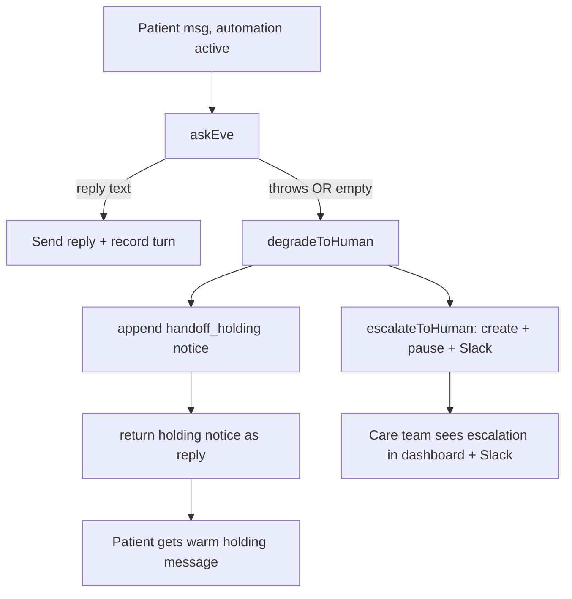

# Graceful degradation: never leave a patient in silence

## Problem

In [transport/src/core.ts](transport/src/core.ts), the Eve auto-respond path has two dead-air exits:

- Eve throws (catch block, ~L208-220): records `ok:false` telemetry, then `return { reply: null, reason: eve_error }`.
- Eve returns empty (~L226-241): records a turn, then `return { reply: null, reason: "empty" }`.

`reply: null` means the patient gets nothing. This is exactly what happened: every Eve turn fatally failed (`session.failed: ...escalateToHuman`), so a clean "hello" got total silence. In a health context, silence is the worst outcome.

## Fix: degrade to a human instead of going silent

When Eve fails or yields nothing, treat it like any other "can't answer autonomously" case: tell the patient we've got them and route to the care team. Reuse the established escalation transaction `escalateToHuman` (machine), which already does create + pause + log + Slack notify in one shot ([convex/machine.ts](convex/machine.ts) L255-301).

### Changes (single file: [transport/src/core.ts](transport/src/core.ts))

1. Import `escalateToHuman` from `@essos/shared` (already exported; not yet imported in core.ts).
2. Add a small internal helper `degradeToHuman(ctx-ish args, { sourceMessageId, errorDetail })` that:
   - Calls `escalateToHuman({ conversationId, patientId, level: "Med", reason: "missing_source_or_unsure", summary: "Automated fallback — the AI concierge could not produce a reply (" + errorDetail + "). Routed to the care team.", sourceMessageId })`. Reusing the existing `missing_source_or_unsure` category (Med) keeps dashboard/Slack rendering consistent; no taxonomy change needed.
   - Appends the existing `HOLDING_NOTICE_MED` (L37) as an `agent` message with `meta: { kind: "handoff_holding" }`, mirroring the `paused_for_review` path (L170-175) so the latch dedupes follow-ups.
   - Returns `{ reply: HOLDING_NOTICE_MED, reason }` so the transport sends it to the patient.
3. Wire it into both exits:
   - Catch block: keep the `recordAgentTurn({ ok:false, error })`, then `return degradeToHuman(..., { errorDetail: message })` instead of `reply:null`.
   - Empty-reply block: keep `recordAgentTurn({ ok:true })`, then degrade with `errorDetail: "empty reply"`.

### Why this is idempotent (no spam loop)

`escalateToHuman` sets `automation_state = "paused_for_review"`. The next patient message hits the existing paused branch (L155-177), which checks the `handoff_holding` latch anchored to the escalation's `created_at` — already satisfied — so follow-ups stay quiet until a human resumes. One holding message + one escalation per failure episode.

## Both environments

The fix lives entirely in the transport (`core.ts`), which runs locally and as the Railway worker ([deploy/transport.Dockerfile](deploy/transport.Dockerfile)) — so it covers both with no env-specific code. It also catches a down/stale **deployed** Eve, not just local. One config dependency to confirm for prod: the Slack bridge must be enabled (`SLACK_ENABLED=1` per [.docs/decisions/017-guest-onboarding-and-deployment.md](.docs/decisions/017-guest-onboarding-and-deployment.md)) so the fallback escalation actually pings the team; otherwise it sits in the dashboard only.

## Verification

- Reproduce live: point the transport at a failing/oversed Eve (or temporarily break it), text the line, and confirm the patient receives the holding message, an escalation appears in the dashboard + Slack, and the conversation flips to `paused_for_review`.
- Confirm a follow-up message does not send a second holding notice (latch holds).
- `pnpm --filter @essos/transport run typecheck` + `biome check`. (A true unit test of `handleInbound` needs ESM mocking of `@essos/shared`; if low-cost I'll add one injecting a throwing `eveRespond`, otherwise verify via the live path.)

## Out of scope (deferred from the earlier options)

Fail-loud preflight/health gating, unified supervised dev stack, conversation de-duplication, and runbook docs were not selected — not included here.