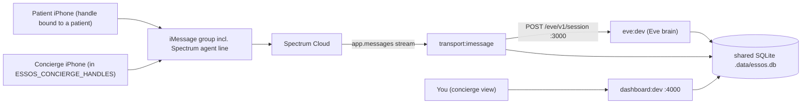

# Live iMessage Test Runbook — Essos Eve Concierge

Your machine is already provisioned: deps installed, `.data/essos.db` seeded, and `.env` has `ANTHROPIC_API_KEY`, `SPECTRUM_PROJECT_ID/SECRET`, `ESSOS_CONCIERGE_HANDLES`, and patient handles bound. So this is mostly verify -> run -> create group -> test.

## How the pieces fit



## Phase 0 — Pre-flight verification (critical)

The live transport matches an inbound sender to a patient by exact normalized handle (`getPatientByHandle` in [transport/src/core.ts](transport/src/core.ts) lines 64-75). Two bindings must be correct or messages get dropped as `unknown_patient`:

- **Patient device handle** must equal a seeded patient `handle`. Currently bound in `mock-assets/patients/*.json`:
  - `pat_maya` -> `+16475719149`
  - `pat_diego` -> `+13105550172`
  - `pat_sofia` -> `+447700900231`
  - If your patient iPhone's iMessage handle (E.164 phone or Apple ID email) is NOT one of these, edit that patient's `handle` in the fixture and re-seed (`pnpm seed:reset`). Pick the patient you want to play as.
- **Concierge device handle** must be present in `ESSOS_CONCIERGE_HANDLES` in `.env` (comma-separated real handles, not display names). Confirm it matches your concierge iPhone's actual sending handle.
- **Spectrum agent line**: note your provisioned iMessage line's phone number from app.photon.codes — you'll add it to the group.

Note: `ESSOS_DEMO_PATIENT` only affects the terminal transport, not iMessage; ignore it here.

Optional clean slate before the test: `pnpm seed:reset` (re-seeds 3 patients + the pre-seeded "stranded at arrivals" escalation; a live group re-binds to its patient on the first inbound message).

## Phase 1 — Start the three processes (3 terminals)

```bash
# Terminal 1 — Eve brain on :3000
pnpm eve:dev

# Terminal 2 — live iMessage bridge (only after Eve is up)
pnpm transport:imessage
# expect: "Essos concierge — iMessage transport running (Spectrum Cloud)."
# if it warns Eve isn't reachable, wait for Terminal 1 then restart this.

# Terminal 3 — admin dashboard
pnpm dashboard:dev   # http://localhost:4000
```

Spectrum delivers inbound messages over an outbound stream (`app.messages` in [transport/src/imessage.ts](transport/src/imessage.ts)), so no public webhook/ngrok is needed.

## Phase 2 — Create the iMessage group chat

1. On the **patient iPhone**, start a new group message (needs >=3 participants for a true group): add the **concierge iPhone** and the **Spectrum agent line number**.
2. **Send the very first message from the patient device.** This matters: a brand-new group has no conversation yet, so Eve only creates one when the first sender resolves to a patient by handle ([core.ts](transport/src/core.ts) lines 64-69). If the concierge texts first, it resolves to `unknown_patient` and is dropped.
3. Eve should show a typing indicator and reply in-thread. The new conversation appears at `http://localhost:4000/conversations`.

## Phase 3 — Run the test scenarios (text from the patient device)

Autonomous answers (Eve replies in-thread, no flag):
- "What's my hotel reservation number?" -> `get_itinerary`
- "When do I need to stop eating before surgery?" -> `get_care_instructions`
- "My flight is delayed, can you move my pickup?" -> records logistics

Escalations (Eve gives a non-clinical reply, raises a flag, pauses automation):
- "Is this swelling on my nose normal?" -> High escalation
- "Can I take ibuprofen tonight?" -> medication decision escalates
- "I can't find my driver and no one's answering." -> stranded escalates

After an escalation, watch the dashboard Overview (`/`) — the open flag appears in the queue and that conversation's automation is paused (further patient texts get no auto-reply).

## Phase 4 — Test the human-handoff loop

1. With an escalation open, **send a message from the concierge device** into the group. Eve stays silent and this is logged as a takeover (`markConciergeTakeover`, [core.ts](transport/src/core.ts) lines 81-95); the conversation flips to `taken_over`.
2. In the dashboard thread view (`/conversations/[id]`), use **Take over / Resolve / Resume Eve** ([dashboard/app/actions.ts](dashboard/app/actions.ts)).
3. After **Resume Eve**, text again from the patient device and confirm Eve answers autonomously once more.

## Phase 5 — Verify end-to-end

- Every patient/concierge/agent turn shows in the thread view and activity log.
- Escalations show severity + reason and pause automation; resolve/resume restores autonomy.
- Telemetry counts on `/` (patients, conversations, open flags, autonomous vs escalated) update on reload.

## Troubleshooting

- **No reply / `unknown_patient`**: patient device handle doesn't match a fixture `handle`; fix the fixture and `pnpm seed:reset`, or have the patient (not concierge) send first.
- **Concierge texts trigger Eve**: that handle isn't in `ESSOS_CONCIERGE_HANDLES` (check exact sending handle, normalized).
- **`eve_error`**: check Terminal 1; usually `ANTHROPIC_API_KEY` or model id (`ESSOS_AGENT_MODEL`).
- **Transport can't reach Eve**: ensure `pnpm eve:dev` is up on :3000 before starting the transport.
- **Spectrum auth/line issues**: re-check `SPECTRUM_PROJECT_ID/SECRET` and that the agent line is active at app.photon.codes.