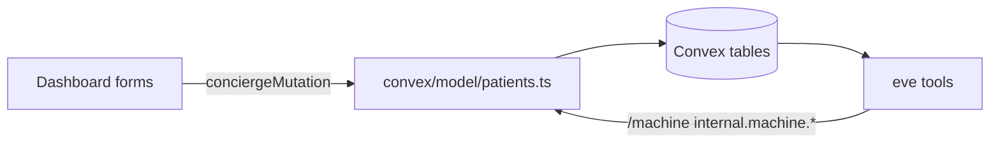

# Patient Management + Better Dashboard

## Why eve "just works"
eve has no cached patient copy. Its tools call `@essos/shared` -> Convex `/machine` -> `internal.machine.*` -> the same `convex/model/patients.ts` helpers the dashboard writes through. So any edit is visible on eve's next tool call. No sync code is required. The only eve-relevant gap is that today the dashboard has read queries + `assignPatient`/`storeUser` but **no edit/create/delete mutations** — we add those.

## Scope decisions (confirmed)
- Documents: real uploads via **Convex file storage** (net-new; storage is currently unused).
- Permissions: any signed-in concierge can edit everything for now (no lead-only gating). Still authenticated via `conciergeMutation`.

## Data flow

## Backend (convex/)

### 1. Schema: enable uploaded documents
In [convex/schema.ts](convex/schema.ts) `source_documents`, add storage-backed fields and relax the seed-only path fields (pre-1.0, widen via optional):
- add `storage_id: v.optional(v.id("_storage"))`, `file_name: v.optional(v.string())`, `content_type: v.optional(v.string())`
- make `markdown_path`, `pdf_path`, `sha256` `v.optional(...)` so uploaded docs don't need disk paths.
Existing seeded rows keep working (already have paths).

### 2. Model helpers — [convex/model/patients.ts](convex/model/patients.ts)
Currently only has `insert*`. Add:
- `updateItineraryEvent(ctx, id, patch)`, `deleteItineraryEvent(ctx, id)`
- `updateCareInstruction(ctx, id, patch)` (stamp `updated_at`), `deleteCareInstruction(ctx, id)`
- `deletePatient(ctx, id)` — cascade delete itinerary, care, patient-scoped source docs (and their storage blobs), then patient. Decide handling for conversations (keep, but null `patient_id`) — keep simple: block delete if conversations exist, surfaced as an error.
- `deleteSourceDocument(ctx, id)` — also `ctx.storage.delete(storage_id)` when present.
Reuse existing `upsert`, `insertItineraryEvent`, `insertCareInstruction`, `insertSourceDocument`.

### 3. Mutations — [convex/mutations.ts](convex/mutations.ts)
New `conciergeMutation`s following the existing pattern (resolve scope, write via model), validated args/returns:
- `upsertPatient` (create + edit core fields: name, handle, procedure, destination, clinic, hotel, companion, dietary)
- `deletePatient`
- `upsertItineraryEvent`, `deleteItineraryEvent`
- `upsertCareInstruction`, `deleteCareInstruction`
- `generateUploadUrl` (returns `ctx.storage.generateUploadUrl()`), `createSourceDocument` (persist `storage_id`/metadata), `deleteSourceDocument`
No lead gating per decision; keep `conciergeMutation` auth + user sync.

### 4. Queries — [convex/queries.ts](convex/queries.ts)
- Add `listPatientsWithMeta`: patients joined with assignee `users` row (name/email/picture) + open-conversation/escalation counts + last-activity, for the new list view. Keep index-backed reads; sort/group done client-side.
- Keep existing `getPatient`, `listItinerary`, `listCareInstructions`, `listSourceDocumentsForPatient`.

### 5. Document serving — [dashboard/app/source-docs/[id]/route.ts](dashboard/app/source-docs/[id]/route.ts)
Branch: if `storage_id` present, redirect/stream from `ctx.storage.getUrl(storage_id)`; else fall back to existing disk read.

## Frontend (dashboard/)

### 6. Form primitives (new) — `dashboard/components/ui/`
None exist yet. Add token-styled `input.tsx`, `textarea.tsx`, `select.tsx`, `field.tsx` (label+error), and `dialog.tsx` (modal, `motion/react`, reduced-motion safe). Export via `components/ui/index.ts`. Match existing `button.tsx`/`card.tsx` token conventions.

### 7. Patient list page (new) — `/patients`
- `dashboard/app/patients/page.tsx` -> new `dashboard/features/patients/patients-list-view.tsx` using `api.queries.listPatientsWithMeta`.
- Controls: search by name/handle, filter by assigned member (dropdown from `api.users.listConcierges`, incl. "Unassigned"), filter by procedure, sort (name, created, last activity, open flags). Group-by-assignee toggle.
- Rows link to `/patients/[id]`; show assignee avatar/name, procedure, destination, open-flag badge.
- "New patient" button -> create dialog (`upsertPatient`).
- Add **Patients** nav item in [dashboard/components/layout/sidebar.tsx](dashboard/components/layout/sidebar.tsx).

### 8. Make patient detail editable — [dashboard/features/patients/patient-detail-view.tsx](dashboard/features/patients/patient-detail-view.tsx)
- Header: "Edit patient" dialog -> `upsertPatient`; "Delete" -> `deletePatient` (confirm).
- [itinerary-timeline.tsx](dashboard/features/patients/itinerary-timeline.tsx): add/edit/remove rows (`upsert/deleteItineraryEvent`) with inline edit dialog.
- [care-instructions.tsx](dashboard/features/patients/care-instructions.tsx): add/edit/remove care entries (`upsert/deleteCareInstruction`), phase + `answer_policy` selectors.
- [source-documents.tsx](dashboard/features/patients/source-documents.tsx): file upload (request `generateUploadUrl` -> POST file -> `createSourceDocument`) and remove (`deleteSourceDocument`).

### 9. Overview polish — [dashboard/features/overview/overview-view.tsx](dashboard/features/overview/overview-view.tsx)
- Add a compact "Patients" panel (recent/unassigned, quick link to `/patients`) using `listPatientsWithMeta`. Keep existing telemetry + escalation queue.

## Verification
- `npx convex dev` typecheck of new functions; dashboard `pnpm` build.
- Manually: create patient -> add itinerary/care/doc -> confirm an eve tool (`get_itinerary`, `get_care_instructions`) returns the new data via `/machine`.