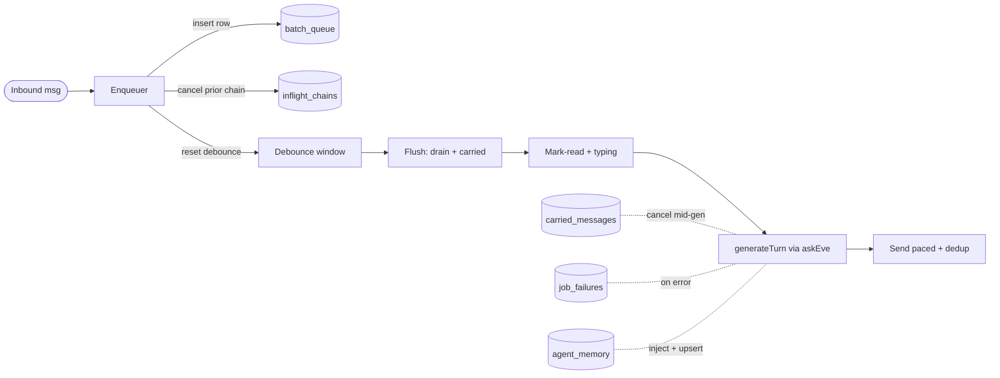

# Pipeline + reliability hardening

Two parts. Part A is three small, independent fixes. Part B is the durable five-stage pipeline + per-resource memory. The just-shipped graceful degradation (`degradeToHuman` in [transport/src/core.ts](transport/src/core.ts)) is preserved throughout.

## Part A - Quick reliability/config fixes

### A1. Eve :3000 port fix (the actual current cause of no replies)
`pnpm eve:dev` runs `eve dev` which serves the TUI on its default port 2000; the transport hardwires `EVE_BASE_URL=http://127.0.0.1:3000`. Align them:
- [eve-concierge/package.json](eve-concierge/package.json): `"dev": "eve dev --no-ui --port 3000"`; add `"tui": "eve dev"`.
- [package.json](package.json): add `"eve:tui": "pnpm -C eve-concierge run tui"`.
- [README.md](README.md) L165: note `pnpm eve:dev` serves :3000, `pnpm eve:tui` for the console, and the `EVE_BASE_URL` override. Prod unaffected (Railway sets explicit `EVE_BASE_URL`).

### A2. Transport -> Eve health gate (loud, not silent)
Today `eveHealthy()` is checked once at startup and only warns ([transport/src/imessage.ts](transport/src/imessage.ts) L42-47).
- Extend [transport/src/health.ts](transport/src/health.ts): add `setEveReachable(reachable, detail?)`; `isHealthy()` becomes `streamHealthy && eveReachable`; `/healthz` 503 body names which is down.
- In [transport/src/imessage.ts](transport/src/imessage.ts): keep startup check, add a periodic (~30s) `eveHealthy()` probe -> `health.setEveReachable(...)`, logging loudly only on a healthy->unreachable transition. Complements degradation: patients still get holding messages; operators now see the cause immediately.

### A3. Split-brain Diego dedupe
[mock-assets/patients/diego-ramirez.json](mock-assets/patients/diego-ramirez.json) has `handle: "+16472215381"` but `seeded_conversation.space_id: "demo-space-diego"`, while live texts derive `imessage:any;-;+16472215381` - so two conversations.
- Set the diego fixture `seeded_conversation.space_id` to `imessage:any;-;+16472215381` so seeded history and live texts unify. Audit other real-phone fixtures; leave terminal-only demo patients on `demo-space-*`.
- Reconcile existing data: `pnpm seed:reset` (needs `ESSOS_ALLOW_SEED`) for a clean slate, or a one-time delete of the orphan `demo-space-diego` conversation.

## Part B - Durable five-stage pipeline + memory

Adopts [.agents/skills/spectrum/best-practices.md](.agents/skills/spectrum/best-practices.md): in-transport orchestration (timers + `AbortController`) with every stage's state persisted to Convex for crash recovery.

### B1. Convex durable substrate
In [convex/schema.ts](convex/schema.ts) add flat, indexed tables: `batch_queue`, `carried_messages`, `inflight_chains` (`chain_id`, `chain_started_at`, `stage`, `cancelled_at`, `start_index`, `sent_guids`), `job_failures`, `agent_memory` (`resource_id`, `working_memory`, `updated_at`). Add validators in [convex/lib/validators.ts](convex/lib/validators.ts). New small model files: `convex/model/pipeline.ts` (enqueue, drain+delete, readCarried, carryForward, claimChain, cancelChain, readInflight, advanceStartIndex), `convex/model/jobFailures.ts` (record + 30-day sweep), `convex/model/memory.ts` (get/upsert by resource). Generalize [convex/model/messages.ts](convex/model/messages.ts) outbound helpers to carry `role: "agent"`, `client_guid`, `send_index` (reusing the `outbound` + dead-letter fields already added).

### B2. machine + shared wiring
For every new fn, the three-place rule: add `internalQuery`/`internalMutation` (with validators) in [convex/machine.ts](convex/machine.ts), register in the `QUERIES`/`MUTATIONS` whitelist in [convex/http.ts](convex/http.ts), and add typed wrappers in [shared/src/convex.ts](shared/src/convex.ts) + types in [shared/src/types.ts](shared/src/types.ts). Includes `listQueuedConversations` + `listOrphanedChains` for recovery.

### B3. Transport orchestrator - new [transport/src/pipeline.ts](transport/src/pipeline.ts)
- Enqueuer: durably insert into `batch_queue` (stable `client_guid = crypto.randomUUID()`), cancel any in-flight chain (`cancelChain` + local `AbortController.abort()`), (re)arm a per-conversation `setTimeout` (`DEBOUNCE_MS`, default 5000). Concierge messages bypass debounce (immediate, preserving takeover).
- Chain runner: on fire, `claimChain` (fresh `chain_id`/`chain_started_at`), run stages behind one `AbortController`; between stages and during generation poll `readInflight`, abort when `cancelled_at > chain_started_at` (per-chain, not per-chat).
- Carry-forward: if aborted after draining, `carryForward` drained rows; next flush prepends them as `[Earlier message] ...`.
- Per-conversation in-memory `Map<{ timer, controller }>`; ticks never overlap.

### B4. The five stages + entry rewiring
- Flush: `drainBatch` (read+delete) + `readCarried`; combine into one turn text. Log each drained patient row individually via `appendMessage` (preserves the `slack_outbox` mirror in [convex/model/messages.ts](convex/model/messages.ts) L62-68 and escalation-source ordering); empty -> end chain.
- Mark-read + typing: best-effort `startTyping`/`stopTyping` (already supported); attempt mark-as-read only if spectrum-ts exposes it, else typing-only. Never fail the turn on indicator errors.
- Generate: refactor `handleInbound` -> `generateTurn({ conversationId, combinedText, sourceGuids, signal })` keeping all current logic (patient/handoff resolution, disclosure latch, `askEve`, telemetry, and the `degradeToHuman` fallback) but (a) pre-combined text, (b) `AbortSignal`, (c) inject per-resource memory, (d) return reply text (no patient logging - moved to flush). Keep a thin `handleInbound` wrapper so [transport/src/smoke.ts](transport/src/smoke.ts) passes unchanged.
- Send paced + dedup: split reply into bubbles, `client_guid = ${chain_id}-${index}`, `advanceStartIndex` after each send, pace by `SEND_PACING_MS`; on retry resume from `start_index` and skip GUIDs in `sent_guids`. Move sending out of `onResult` in [transport/src/imessage.ts](transport/src/imessage.ts) and [transport/src/terminal.ts](transport/src/terminal.ts); `runMessageLoop` ([transport/src/runLoop.ts](transport/src/runLoop.ts)) calls `pipeline.enqueue(...)` instead of `handleInbound`.

### B5. Recovery
Wrap stage error paths in `recordJobFailure(queue, chainId, payload, error)` (fail-safe). On startup, `recoverPipeline()` re-arms a chain for any conversation with `batch_queue`/`carried_messages` rows or a non-terminal `inflight_chains` stage. Periodic 30-day retention sweep.

### B6. Per-resource agent memory
`resource_id = normalizeHandle(authorHandle)` (the person, distinct from the thread). Inject `getAgentMemory(resourceId)` as a compact "What we know about this person" block in [transport/src/context.ts](transport/src/context.ts). Add an eve tool (e.g. `agent/tools/remember_patient.ts`) so Eve writes durable notes via `upsertAgentMemory`; inject on the next turn. Document: memory is per-person, eve session continuity stays per-conversation.

### B7. Config, tests, docs
- Env in [transport/src/env.ts](transport/src/env.ts): `DEBOUNCE_MS`, `SEND_PACING_MS`, `INFLIGHT_POLL_MS`, `JOB_FAILURE_RETENTION_DAYS`.
- Tests: debounce reset, drain-survives-cancel, carry-forward prepend, per-chain cancel comparison, `start_index` resume skips re-sends, GUID dedup; Convex model CRUD + retention. Keep the `handleInbound` smoke suite green via the wrapper.
- `pnpm typecheck`, transport + convex suites, `biome check`. Manually verify a 4-message burst yields one reply and a mid-generation follow-up cancels + re-batches.
- Add an ADR documenting the pipeline alongside the notes referenced in `core.ts`.

## Risks / verification points
- Spectrum `clientGuid` + mark-as-read are unconfirmed in the docs; Part B uses worker-side dedup and typing-only fallback.
- Moving patient logging to flush must preserve escalation-source ordering and the disclosure/handoff/holding latches.
- Debounce adds first-reply latency (acceptable per the skill; tunable via `DEBOUNCE_MS`). Terminal provider lacks typing/threading - degrade gracefully.