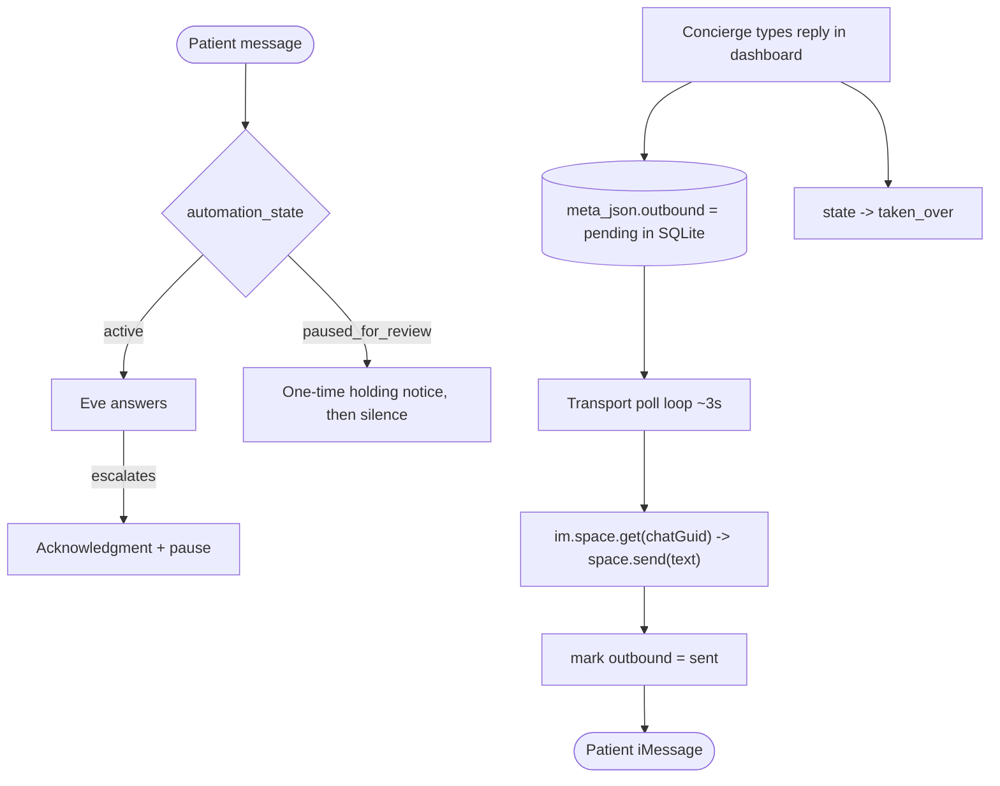

# Handoff Patient Feedback and Concierge Reply Bridge

## Decision

Escalation must be a real, two-sided handoff rather than a silent dead-end. When Eve escalates, the patient is kept informed, and the concierge can reply to the patient directly from the dashboard. Concretely:

1. **Patient acknowledgment on escalation.** `escalate_to_human` already requires Eve to reply with a brief, warm, non-clinical acknowledgement in the same turn ([eve-concierge/agent/tools/escalate_to_human.ts](../../eve-concierge/agent/tools/escalate_to_human.ts)).
2. **One-time holding notice while paused.** The first patient message that arrives after automation is paused gets a single, severity-aware "the care team is reviewing this" notice; subsequent messages stay silent until a human engages or Eve resumes ([transport/src/core.ts](../../transport/src/core.ts)).
3. **Concierge -> patient reply bridge.** A concierge can type a reply in the dashboard; it is queued in SQLite and delivered to the patient's iMessage by the transport, and the thread is marked `taken_over` so Eve stays paused ([dashboard/lib/actions.ts](../../dashboard/lib/actions.ts), [transport/src/outbound.ts](../../transport/src/outbound.ts)).
4. **Waiting visibility.** The dashboard surfaces how long an escalation has been open and how many patient messages are awaiting a reply, so the concierge has an at-a-glance SLA signal ([dashboard/features/conversations/flags-panel.tsx](../../dashboard/features/conversations/flags-panel.tsx)).

## The bug that prompted this

During the first live iMessage test the patient appeared to get "no response." Two things were happening:

- **A multi-turn stream-replay bug.** Eve's session stream replays the whole session from `session.started` on every connect. The transport's reader settled on the first `turn.completed` and returned an earlier turn's answer, so the escalation acknowledgment (and every later turn) was clobbered by stale text. Fixed by counting `turn.completed` to the current turn and reducing only that turn's events ([transport/src/eveClient.ts](../../transport/src/eveClient.ts)).
- **Silence by design.** Once Eve escalated, `automation_state` became `paused_for_review`, and the transport returned no reply for any follow-up message ([ADR 003](003-human-handoff-and-takeover.md)). Correct for safety, but indistinguishable from a broken bot.

This was not a Spectrum problem; the transport was receiving and resolving messages correctly the whole time.

## Why

A health-tourism patient who asks a medication or post-op question at 2am and hears nothing back will assume the system is broken — exactly when trust matters most. ADR 003 already left room for "brief acknowledgements if configured" on `paused_for_review`; this ADR configures it and adds the human's side of the loop so the handoff actually completes inside the same iMessage thread the patient is already using.

## Design

- **Holding-notice dedup** is an in-memory latch per conversation, cleared when the conversation returns to `active`, so a later re-escalation notifies again. A transport restart re-arms it (at most one extra notice) — acceptable for the cost of zero added persistence.
- **The bridge reuses the existing `messages.meta_json` column** (no schema migration): dashboard-authored concierge replies are stored with `{ outbound: "pending" }`, the transport drains them via `listPendingOutbound` and `markOutboundDelivered`, and re-acquires the patient DM with `im.space.get(chatGuid)` (the stored `space_id` minus the `imessage:` prefix), falling back to `im.space.create(user)`.

## Consequences / trade-offs

- **At-least-once delivery.** The bridge marks a message delivered only after a successful `space.send`; a crash between send and mark could resend. Polling adds a few seconds of latency. Both are acceptable for a concierge reply; a production version would use stable client GUIDs + a resume cursor (see the Spectrum best-practices pipeline).
- **Shared-pool single-line constraint.** On the Free/Pro plan each end user is routed through a different shared-pool number and group creation is unavailable ([ADR 004](004-spectrum-imessage-transport.md)), so the patient and concierge can't share one iMessage group via separate DMs. The dashboard bridge is what makes the concierge reachable to the patient regardless.
- **`taken_over` stays silent from Eve** because the human's replies now reach the patient directly through the bridge.

## Future / production hardening (out of scope)

- The five-stage debounce/batch/cancel/retry inbound pipeline from the Spectrum best-practices skill (durable queue, idempotent sends, carry-forward).
- Proactive outbound on resume (an automatic "we're all set" message) — the bridge already lets a human send this manually.
- Fixing Maya's shared-pool line enrollment (a Spectrum-account task, tracked separately).
