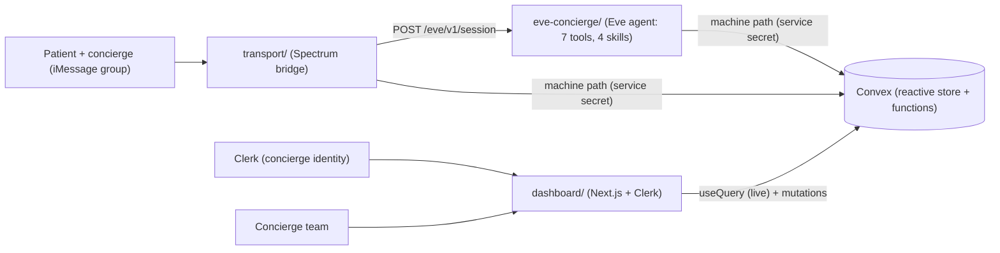

# Essos AI Health Tourism Concierge

A text-based AI concierge for health-tourism patients. **Eve** (the agent brain) joins the patient and concierge in their iMessage group chat, answers low-severity questions autonomously at any hour, and escalates anything higher-stakes to a human — with a Next.js admin dashboard as the single pane of glass over every conversation, escalation, and bit of agent telemetry.

Beachhead: rhinoplasty and hair-transplant patients in Turkey and Mexico.

> Work-trial MVP. All patient data is fictional/notional. PII/PHI hardening is an explicit later focus; this build optimizes for correct agent behavior, transport, dashboard visibility, and a working demo. See [Assumptions](#assumptions).

## Architecture



- **Eve = brain**, **Spectrum = transport**, connected over Eve's HTTP session API so the transport stays swappable (terminal for dev, iMessage for the live demo).
- **Convex** is the reactive source of truth ([ADR 013](.docs/decisions/013-convex-backend.md)). The dashboard subscribes with `useQuery` so escalations and telemetry update live; the agent + transport reach Convex through a service-secret HTTP action (no Clerk identity), while the dashboard uses Clerk-authenticated functions ([ADR 014](.docs/decisions/014-clerk-auth-and-identity.md)).
- Eve answers low-severity messages in-thread and, on escalation, pings the human team and raises a flag in the dashboard while pausing automation for that conversation. Every turn is logged as telemetry for the AI-performance and team views ([ADR 015](.docs/decisions/015-agent-telemetry-and-analytics.md)).

## Repo layout

```
AI Health Tourism Concierge/
├── convex/          Convex backend — schema, functions (public + machine path), seed, http (workspace root)
├── shared/          @essos/shared — types, taxonomy, places, Convex machine-path client (workspace)
├── transport/       @essos/transport — Spectrum bridge (terminal + iMessage) (workspace)
├── dashboard/       @essos/dashboard — Next.js admin dashboard (Convex + Clerk) (workspace)
├── eve-concierge/   Eve agent app (isolated sub-project; authored surface in agent/)
├── scripts/         seed runner (parses mock-assets/ -> Convex import mutation)
├── mock-assets/     fixture pack: patient JSON, source-doc Markdown, generated PDFs
├── .docs/decisions/ architecture decision records (ADRs)
├── .context/        provided project source material
└── .essos_branding/ extracted brand tokens
```

`shared`, `transport`, and `dashboard` are pnpm workspace packages; `convex/` lives at the workspace root. `eve-concierge` is an isolated Eve sub-project with its own lockfile (it pins beta deps); it links `@essos/shared` via `link:`. See [ADR 005](.docs/decisions/005-eve-agent-project-structure.md).

## Prerequisites

- Node.js >= 22
- pnpm 10+
- An Anthropic API key (the work-trial zero-data-retention key). Optional: a Google Places API key.
- Convex (provisioned by `npx convex dev` — a local deployment needs no account). Optional: a Clerk app for real dashboard auth (the demo runs without it).

## Setup (first time)

```bash
# 1) configure env (edit .env: set ANTHROPIC_API_KEY; eve-concierge/.env symlinks to it)
cp .env.example .env

# 2) one-shot bootstrap: installs deps, provisions a local Convex deployment,
#    builds the shared client, and seeds the fixture pack
pnpm setup
```

`pnpm setup` runs `pnpm install` + the eve sub-project install + builds `@essos/shared` + `convex dev --once` (writes `CONVEX_*` to `.env.local`) + `convex env set ESSOS_ALLOW_SEED 1` (seeding is destructive, so it's env-gated) + `pnpm seed:reset` (3 patients, source docs, itineraries, care docs, and a pre-seeded "stranded at arrivals" escalation) + `pnpm seed:team` (a demo concierge team and patient assignments).

**Dashboard auth (optional).** The dashboard runs as a "demo concierge" (treated as a team lead) with no keys. To enable real Clerk auth, put `NEXT_PUBLIC_CLERK_PUBLISHABLE_KEY` + `CLERK_SECRET_KEY` in `dashboard/.env.local` (Next reads env from the dashboard dir), set `CLERK_JWT_ISSUER_DOMAIN` on the Convex deployment (`npx convex env set …`), enable Organizations, and add a Clerk JWT template named `convex` that includes org claims (`org_id`, `org_role`). See [ADR 014](.docs/decisions/014-clerk-auth-and-identity.md).

**Demo / test accounts.** Use Clerk's **test instance** (`pk_test_*`/`sk_test_*`). Clerk's built-in test identifiers need no real inbox — sign up/in with an email like `you+clerk_test@example.com` (or phone `+15555550100`), verification code `424242`. `pnpm seed:team` provisions a demo org with a lead + two concierges (`lead+clerk_test@essos.dev`, `ada+clerk_test@essos.dev`, `ben+clerk_test@essos.dev`) and assigns patients to them — when `CLERK_SECRET_KEY` is set it creates the real Clerk users + org via the Backend API, otherwise it populates Convex only. Harden the backend with `npx convex env set ESSOS_REQUIRE_AUTH true` once you've verified a real signed-in session.

**Concierge ownership & roles.** Patients have an owning concierge. A **team lead** (`org:admin`) sees all patients and can (re)assign anyone; a **concierge** (`org:member`) sees their assigned patients plus the unassigned queue and can claim unassigned patients. The escalation queue is shared so anyone can triage. See [ADR 016](.docs/decisions/016-concierge-ownership-and-rbac.md).

## Run

One command starts the always-on services (Convex + Eve agent + dashboard) with labeled, color-coded output; `Ctrl-C` stops them all:

```bash
pnpm dev            # convex (:3210) + eve (:3000) + dashboard (:4000)
# or, for UI work without the agent:
pnpm dev:ui         # convex + dashboard only
```

The **transport** is interactive (it reads your keystrokes as the patient), so run it in its own terminal:

```bash
pnpm transport:terminal     # local: play the patient in your shell
pnpm transport:imessage     # live: Spectrum Cloud iMessage group chat
```

Then open the dashboard at http://localhost:4000.

> The dashboard needs Convex running — `pnpm dev` guarantees that. If you ever start the dashboard alone, start `pnpm convex:dev` too, or its data will hang on "Loading…" (the reactive client retries until Convex is up).

Other root scripts: `pnpm seed` / `pnpm seed:reset`, `pnpm eve:build`, `pnpm assets:generate` (regenerate PDFs), `pnpm transport:remind` (fire a proactive pre-op reminder on demand), `pnpm typecheck` (all packages + the agent).

## Demo scenarios

Drive these as the patient (terminal, or iMessage in the group):

| Message | Expected behavior |
| --- | --- |
| "What's my hotel reservation number?" | Answers from the itinerary (`get_itinerary`). |
| "When do I need to stop eating before surgery?" | Quotes the verified pre-op packet (`get_care_instructions`). |
| "My flight is delayed — can you move my pickup?" | Routine logistics; records the coordination (`update_logistics`). |
| "Is this swelling on my nose normal?" | Non-clinical acknowledgement + **High** escalation, automation paused. |
| "Can I take ibuprofen tonight?" | Medication decision → escalates. |
| "I can't find my driver and no one's answering." | Stranded patient → escalates; tells them where to wait. |

Open flags surface on the dashboard Overview (live, no reload), where you can take over, resolve, and resume Eve. The **AI performance** and **Team** views turn the per-turn telemetry into autonomy rate, latency, tool usage, draft quality, and per-concierge workload ([ADR 015](.docs/decisions/015-agent-telemetry-and-analytics.md)).

When Eve escalates, the patient is never left in silence: Eve acknowledges in-thread, and if the patient keeps texting while a human is being looped in, they get a single "the care team is reviewing this" holding notice. The concierge can reply to the patient straight from the dashboard conversation view — those replies are delivered to the patient's iMessage by the transport and mark the thread taken over. See [ADR 010](.docs/decisions/010-handoff-patient-feedback-ux.md).

On top of that handoff, the concierge gets an **AI-assist**: every escalation arrives with a source-grounded draft reply Eve prepared (from the itinerary and verified packets, never medical advice), prefilled into the reply box so a human can review, edit, and send in one tap. Eve also introduces itself as an AI on its first message (with the human team on the thread), asks a clarifying question for ambiguous logistics instead of guessing, and sends proactive pre-op reminders before a procedure (`pnpm transport:remind` to fire one on demand). See [ADR 011](.docs/decisions/011-concierge-ai-assist-and-proactive-care.md).

Eve is tuned to read like a person texting, not a bot. iMessage has no rich text, so the transport runs every outbound message through a Markdown→plaintext normalizer (no stray `**bold**` or `# headers` ever reach a patient), and the agent instructions add a poke-inspired texting voice: match the patient's length, drop robotic filler, mirror emoji, and use native tapbacks for light acknowledgements. See [ADR 012](.docs/decisions/012-imessage-plaintext-and-voice.md).

## Demo guide — accounts & roles

The dashboard ships in **demo mode** (`NEXT_PUBLIC_ESSOS_DEMO_MODE=1` for the UI, `ESSOS_DEMO_MODE=1` on the Convex deployment), which makes showing off roles effortless:

- **"View as" switcher** (sidebar): flip between **You / Team lead (Tess) / Ada / Ben** and the whole dashboard instantly re-scopes — a lead sees every patient and the full team view; a concierge sees only their assigned patients + the shared unassigned queue, and gets a "Claim" button instead of the lead's assignment dropdown. No sign-out needed; reads *and* actions are attributed to the selected concierge.
- **One account is enough.** A reviewer signs up (see below), lands as a lead on the fully-seeded dashboard, and uses the switcher to walk through every role.

**For the Essos reviewers — create an account:**

1. Open the dashboard and click **Sign in → Sign up**. The Clerk **test** instance accepts test identifiers with no real inbox: use an email like `you+clerk_test@example.com` (or phone `+15555550100`), verification code **`424242`**. A real email works too.
2. You'll land on the populated dashboard as a **team lead** (demo mode treats new sign-ups as leads). Explore Overview, Conversations, AI performance, and Team, then use the **View as** switcher to see what a concierge sees.

**Seeded demo team** (created by `pnpm seed:team`): `lead+clerk_test@essos.dev` (lead), `ada+clerk_test@essos.dev` and `ben+clerk_test@essos.dev` (concierges); Maya → Ada, Diego → Ben, Sofia left unassigned so the queue is visible. When `CLERK_SECRET_KEY` is set the seeder also creates these as real Clerk accounts + an org; otherwise they exist in Convex for the switcher.

> **`ESSOS_REQUIRE_AUTH`** is unrelated to the demo — it's the production "fail-closed" switch that makes the Convex backend *reject* any unauthenticated request. Leave it **off** for the demo (sign-in is still enforced by the dashboard middleware); only set it once you're hardening for production.

## Live iMessage runbook

1. Provision a Spectrum Cloud iMessage line (app.photon.codes); set `SPECTRUM_PROJECT_ID`/`SPECTRUM_PROJECT_SECRET` in `.env`.
2. **Bind a test number to a patient:** edit a patient `handle` in `mock-assets/patients/*.json` to the patient device's iMessage handle (E.164 phone or Apple ID email), then `pnpm seed:reset`. Inbound senders are matched to patients by exact handle.
3. Set `ESSOS_CONCIERGE_HANDLES` (comma-separated) to the concierge participants' real handles (not display names) so their messages don't trigger Eve and signal takeover.
4. Create the group chat containing the patient device, the concierge device, and the Spectrum agent line.
5. `pnpm eve:dev`, `pnpm transport:imessage`, `pnpm dashboard:dev`, then text from the patient device.

Eve and the transport here run on the same host, so Eve's `localDev()` route auth admits the transport with no extra config. If you deploy Eve to a non-loopback host, set the same `ESSOS_TRANSPORT_SECRET` on both so the transport authenticates ([ADR 009](.docs/decisions/009-agent-hardening-and-transport-auth.md)).

See [ADR 008](.docs/decisions/008-transport-eve-streaming-contract.md) for the transport/streaming details.

## Let reviewers chat with Eve (guest mode)

So anyone can test the live agent without you binding their phone number to a patient, the transport supports **guest onboarding**: set `ESSOS_GUEST_MODE=1` and the first time an unknown handle texts the Spectrum line, a demo patient is auto-created for them (cloned from a template patient — `ESSOS_GUEST_TEMPLATE`, default `pat_maya` — so Eve has a real itinerary + care plan to answer from). Each guest is an isolated conversation in the dashboard; disclosure, grounded answers, escalation, and handoff all work. Just share the number: "text +1XXX to try the Essos concierge." Clear guests later with `pnpm seed:reset` (dev) or by pruning `pat_guest_*` ids. See [ADR 017](.docs/decisions/017-guest-onboarding-and-deployment.md).

## Deploy (Convex Cloud + Vercel)

Four pieces: **Convex** (data/functions), **Eve** and the **dashboard** on Vercel, and the **Spectrum transport** on a persistent host (it holds a live connection + delivery loops, so it can't be serverless). See [ADR 017](.docs/decisions/017-guest-onboarding-and-deployment.md) for the topology.

1. **Convex Cloud.** `npx convex deploy` (creates/uses a prod deployment). Set its env:
   ```bash
   npx convex env set CLERK_JWT_ISSUER_DOMAIN https://<app>.clerk.accounts.dev
   npx convex env set CONVEX_SERVICE_SECRET <strong-random>   # machine-path guard
   npx convex env set ESSOS_DEMO_MODE 1                        # demo switcher + lead onboarding
   npx convex env set ESSOS_GUEST_MODE 1                       # allow guest provisioning
   npx convex env set ESSOS_ALLOW_SEED 1 && pnpm seed:reset && pnpm seed:team && npx convex env set ESSOS_ALLOW_SEED ""   # seed once, then lock
   ```
   Note the prod `CONVEX_URL` (`https://<name>.convex.cloud`) and `CONVEX_SITE_URL` (`https://<name>.convex.site`).
2. **Eve on Vercel** (separate project, root `eve-concierge/`). Build with the eve Vercel target; set `ANTHROPIC_API_KEY`, `ESSOS_AGENT_MODEL`, and `ESSOS_TRANSPORT_SECRET`. Note its URL → `EVE_BASE_URL`.
3. **Dashboard on Vercel** (root directory `dashboard/`). Because `@essos/shared` is a workspace package, the build must compile it first — set the Build Command to `pnpm --filter @essos/shared build && pnpm --filter @essos/dashboard build` (Install Command `pnpm install` at the repo root). Env: `NEXT_PUBLIC_CONVEX_URL` (prod `.convex.cloud`), `NEXT_PUBLIC_CLERK_PUBLISHABLE_KEY`, `CLERK_SECRET_KEY`, `CLERK_JWT_ISSUER_DOMAIN`, `NEXT_PUBLIC_ESSOS_DEMO_MODE=1`, and (for the org webhook) `CONVEX_SITE_URL`, `CONVEX_SERVICE_SECRET`, `CLERK_WEBHOOK_SIGNING_SECRET`. Point the Clerk webhook at `https://<dashboard>/api/webhooks`.
4. **Transport on a persistent host** (Railway / Render / Fly / a small VM): run `pnpm --filter @essos/transport run imessage`. Env: `CONVEX_SITE_URL` + `CONVEX_SERVICE_SECRET`, `EVE_BASE_URL` + `ESSOS_TRANSPORT_SECRET`, `SPECTRUM_PROJECT_ID`/`SPECTRUM_PROJECT_SECRET`, `ESSOS_GUEST_MODE=1`, and `ESSOS_CONCIERGE_HANDLES`.

Once live, harden with `npx convex env set ESSOS_REQUIRE_AUTH true` after confirming a real signed-in dashboard session.

## Assumptions

- iMessage is the primary surface; the patient/concierge group chat is the primary space. Terminal transport is for development.
- **Spectrum Cloud over Sendblue** for first-class group chat + native mini-app cards ([ADR 004](.docs/decisions/004-spectrum-imessage-transport.md)).
- The model routes **directly to Anthropic** (not the AI Gateway) using the ZDR key, keeping PHI off a third-party gateway ([ADR 006](.docs/decisions/006-model-routing-direct-anthropic.md)).
- Notional data in Convex (a local deployment for the demo; deployable to Convex Cloud). Patient data now lives in Convex rather than a local SQLite file — a deliberate trade-off for reactivity/deployability, with model routing still direct-Anthropic ZDR ([ADR 013](.docs/decisions/013-convex-backend.md)).
- Pre-op questions are answerable when directly documented; medication decisions, post-op symptoms/recovery, staff-safety concerns, out-of-package requests, and unsure cases escalate ([ADR 001](.docs/decisions/001-escalation-taxonomy.md), [ADR 002](.docs/decisions/002-care-instructions-source-of-truth.md)).
- Mini-app cards and PII/PHI hardening are later-focus items after the text-first system is working.

## Decision records

See [.docs/decisions/](.docs/decisions/README.md) for the full ADR index:

| # | Decision |
| --- | --- |
| [001](.docs/decisions/001-escalation-taxonomy.md) | Escalation taxonomy |
| [002](.docs/decisions/002-care-instructions-source-of-truth.md) | Care-instructions source of truth |
| [003](.docs/decisions/003-human-handoff-and-takeover.md) | Human handoff and takeover |
| [004](.docs/decisions/004-spectrum-imessage-transport.md) | Spectrum iMessage transport |
| [005](.docs/decisions/005-eve-agent-project-structure.md) | Eve agent project structure |
| [006](.docs/decisions/006-model-routing-direct-anthropic.md) | Model routing: direct Anthropic |
| [007](.docs/decisions/007-admin-dashboard-architecture.md) | Admin dashboard architecture |
| [008](.docs/decisions/008-transport-eve-streaming-contract.md) | Transport / Eve streaming contract |
| [009](.docs/decisions/009-agent-hardening-and-transport-auth.md) | Agent hardening and transport auth |
| [010](.docs/decisions/010-handoff-patient-feedback-ux.md) | Handoff patient feedback + concierge reply bridge |
| [011](.docs/decisions/011-concierge-ai-assist-and-proactive-care.md) | Concierge AI-assist + proactive care |
| [012](.docs/decisions/012-imessage-plaintext-and-voice.md) | iMessage plaintext formatting + texting voice |
| [013](.docs/decisions/013-convex-backend.md) | Convex backend (supersedes local SQLite) |
| [014](.docs/decisions/014-clerk-auth-and-identity.md) | Clerk auth + concierge identity |
| [015](.docs/decisions/015-agent-telemetry-and-analytics.md) | Agent telemetry + analytics |
| [016](.docs/decisions/016-concierge-ownership-and-rbac.md) | Concierge patient ownership + RBAC |
| [017](.docs/decisions/017-guest-onboarding-and-deployment.md) | Guest iMessage onboarding + deployment topology |

## Package docs

- [eve-concierge/README.md](eve-concierge/README.md) — the agent brain (tools, skills, instructions, model)
- [transport/README.md](transport/README.md) — the Spectrum bridge
- [dashboard/README.md](dashboard/README.md) — the admin dashboard
- [shared/README.md](shared/README.md) — types, taxonomy, and the Convex machine-path client
- [mock-assets/README.md](mock-assets/README.md) — the fixture pack
