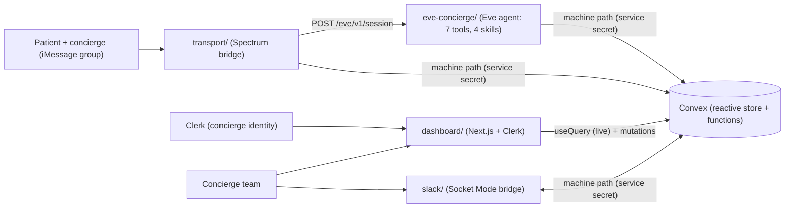

# Essos AI Health Tourism Concierge

A text-based AI concierge for health-tourism patients. **Eve** (the agent brain) joins the patient and concierge in their iMessage group chat, answers low-severity questions autonomously at any hour, and escalates anything higher-stakes to a human — with a Next.js admin dashboard as the single pane of glass over every conversation, escalation, patient record, and bit of agent telemetry.

Beachhead: rhinoplasty and hair-transplant patients in Turkey and Mexico.

> **Live demo:** dashboard at **https://essos-dashboard.vercel.app** (loads in demo mode; sign in to test roles). To try the agent over iMessage, text the Spectrum line — guest mode provisions a demo patient on first contact. See [docs/reviewer-demo.md](docs/reviewer-demo.md).

> Work-trial MVP. All patient data is fictional/notional. PII/PHI hardening is an explicit later focus; this build optimizes for correct agent behavior, transport, dashboard visibility, and a working demo. See [Assumptions](#assumptions).

## Tech stack / Built with

| Layer | Tech | Role |
| --- | --- | --- |
| Agent | [Eve](eve-concierge/README.md) · Anthropic Claude (direct, ZDR) | The concierge brain — 7 tools, 4 skills; routes direct to Anthropic to keep PHI off a gateway ([ADR 006](docs/decisions/archive/006-model-routing-direct-anthropic.md)) |
| Transport | [Spectrum Cloud](transport/README.md) (iMessage) · terminal | Patient-facing channel; swappable behind Eve's HTTP session API ([ADR 004](docs/decisions/archive/004-spectrum-imessage-transport.md)) |
| Backend / data | [Convex](docs/decisions/archive/013-convex-backend.md) | Reactive store + functions; single source of truth for conversations, patients, escalations, telemetry |
| Dashboard | Next.js · React · Tailwind | Admin single pane of glass; live via Convex `useQuery` ([ADR 007](docs/decisions/archive/007-admin-dashboard-architecture.md)) |
| Auth / identity | [Clerk](docs/decisions/archive/014-clerk-auth-and-identity.md) (Organizations) | Concierge identity + org roles for RBAC ([ADR 016](docs/decisions/archive/016-concierge-ownership-and-rbac.md)) |
| Team bridge | [Slack](slack/README.md) (Socket Mode) | Optional — escalations + handoff actions where the team already works ([ADR 019](docs/decisions/archive/019-slack-concierge-bridge.md)) |
| Language / tooling | TypeScript · pnpm workspaces | Monorepo (`shared`/`transport`/`dashboard`/`slack` + root `convex/`; `eve-concierge` isolated) ([ADR 005](docs/decisions/archive/005-eve-agent-project-structure.md)) |
| Hosting | Vercel (dashboard) · Railway (Eve + transport + Slack) · Convex Cloud (data) | Deploy topology + CI/CD ([ADR 017](docs/decisions/archive/017-guest-onboarding-and-deployment.md), [ADR 018](docs/decisions/archive/018-deploy-pipeline-cicd.md)) |

## Architecture



- **Eve = brain**, **Spectrum = transport**, connected over Eve's HTTP session API so the transport stays swappable (terminal for dev, iMessage for the live demo).
- **Convex** is the reactive source of truth. The dashboard subscribes with `useQuery` so escalations and telemetry update live; concierges manage patient records from the dashboard. The agent + transport reach Convex through a service-secret HTTP action (no Clerk identity), while the dashboard uses Clerk-authenticated functions.
- Eve answers low-severity messages in-thread and, on escalation, pings the human team and raises a flag in the dashboard while pausing automation for that conversation. Every turn is logged as telemetry.
- The **Slack bridge** brings escalations and handoff actions into where the concierge team already works, while every action still flows through the same Convex state.

The full rationale for every part of this — escalation policy, handoff UX, transport, agent hardening, platform — is consolidated in **[docs/decisions/README.md](docs/decisions/README.md)**.

## Repo layout

```
AI Health Tourism Concierge/
├── convex/          Convex backend — schema, functions (public + machine path), seed, http (workspace root)
├── shared/          @essos/shared — types, taxonomy, places, Convex machine-path client (workspace)
├── transport/       @essos/transport — Spectrum bridge (terminal + iMessage) (workspace)
├── dashboard/       @essos/dashboard — Next.js admin dashboard (Convex + Clerk) (workspace)
├── slack/           @essos/slack — Slack concierge bridge (Socket Mode) (workspace)
├── eve-concierge/   Eve agent app (isolated sub-project; authored surface in agent/)
├── scripts/         seed runner (parses mock-assets/ -> Convex import mutation)
├── mock-assets/     fixture pack: patient JSON, source-doc Markdown, generated PDFs
├── docs/            decisions summary + archive, runbooks, reviewer demo
└── .context/        provided project source material
```

`shared`, `transport`, `dashboard`, and `slack` are pnpm workspace packages; `convex/` lives at the workspace root. `eve-concierge` is an isolated Eve sub-project with its own lockfile; it links `@essos/shared` via `link:`. See [ADR 005](docs/decisions/archive/005-eve-agent-project-structure.md).

## Quickstart

```bash
cp .env.example .env   # set ANTHROPIC_API_KEY
pnpm setup             # install, provision local Convex, build shared, seed fixtures
pnpm dev               # convex (:3210) + eve (:3000) + dashboard (:4000)
```

Then open http://localhost:4000. Full setup, run, and demo-account details are in the **[local development runbook](docs/runbooks/local-development.md)**; the live iMessage line is in the **[live iMessage runbook](docs/runbooks/live-imessage.md)**; cloud deploys are in the **[deploy runbook](docs/runbooks/deploy.md)**.

## Demo scenarios

Drive these as the patient (terminal, or iMessage in the group):

| Message | Expected behavior |
| --- | --- |
| "What's my hotel reservation number?" | Answers from the itinerary (`get_itinerary`). |
| "When do I need to stop eating before surgery?" | Quotes the verified pre-op packet (`get_care_instructions`). |
| "My flight is delayed — can you move my pickup?" | Routine logistics; records the coordination (`update_logistics`). |
| "Is this swelling on my nose normal?" | Non-clinical acknowledgement + **High** escalation, automation paused. |
| "Can I take ibuprofen tonight?" | Medication decision → escalates. |
| "I can't find my driver and no one's answering." | Stranded patient → escalates; tells them where to wait. |
| "Please call me Ms. Okafor and remember I'm travelling with my sister." | Eve saves a durable note (`remember_patient`); it appears in the **What Eve remembers** card. |
| (send "hey" / "wait" / "the question" in quick succession) | Debounced into **one** reply, not three; a follow-up mid-reply cancels and re-batches. |
| "pls resume" (while a human has the thread) | Patient self-serve: clears the flag, resumes Eve, confirms in-thread. |
| "Send me my itinerary card" | Sends a signed Essos mini-app card with itinerary, clinic/hotel, transport, codes, and source docs. |
| "Can I see my source documents?" | Sends a signed source-data card; rows can be viewed, shared, copied, or downloaded. |

Open flags surface on the dashboard Overview (live, no reload), where a concierge can take over, resolve, resume Eve, and reply to the patient — the same actions live on each Slack escalation card. The **AI performance** and **Team** views turn per-turn telemetry into autonomy rate, latency, tool usage, draft quality, and per-concierge workload.

## What it gets right

The plumbing — an AI agent in an iMessage group chat wired to a CRM — is a solved integration. The product is the **experience**: the tone it texts in, the exact context it has the moment a patient asks, and a handoff that never drops the patient or burns out the team. What that looks like here:

- **Safe by construction.** Eve answers only from a documented source of truth (itinerary, verified pre-op packets) and escalates anything clinical — medication, symptoms, recovery judgment, staff safety. The guardrail is a clamp in code, and per-patient overrides can only *tighten* it, never loosen it ([escalation taxonomy](docs/decisions/archive/001-escalation-taxonomy.md), [per-patient overrides](docs/decisions/archive/021-per-patient-policy-overrides.md)).
- **Never leaves the patient in silence.** On escalation the patient gets a warm acknowledgement and a single holding notice; the concierge replies straight from the dashboard or Slack and it lands in the same iMessage thread ([handoff UX](docs/decisions/archive/010-handoff-patient-feedback-ux.md)).
- **Reads like a person, not a bot.** A debounced five-stage pipeline turns a burst of texts into one paced reply, a Markdown→plaintext normalizer guarantees no `**bold**` ever reaches a patient, and the voice is tuned to match the patient's length and energy ([texting voice](docs/decisions/archive/012-imessage-plaintext-and-voice.md), [inbound pipeline](docs/decisions/archive/023-spectrum-inbound-pipeline.md)).
- **Built for the team, not just the patient.** Every escalation arrives with a source-grounded AI-drafted reply the concierge can send in one tap, and the whole workflow is mirrored into Slack — treating concierge cognitive load and burnout as upstream of patient care ([AI-assist](docs/decisions/archive/011-concierge-ai-assist-and-proactive-care.md), [Slack bridge](docs/decisions/archive/019-slack-concierge-bridge.md)).
- **Gets better over time.** Per-patient memory carries context across a trip; full per-turn telemetry plus a human "was this escalation necessary?" label make over-escalation measurable per category — the explicit trigger to widen what Eve may answer — and each real mistake becomes a committed regression test ([continuous learning](docs/decisions/README.md#how-it-gets-better-over-time)).

The full reasoning, plus what's intentionally left for later, is in **[docs/decisions/README.md](docs/decisions/README.md)**.

## Assumptions

- iMessage is the primary surface; the patient/concierge group chat is the primary space. Terminal transport is for development.
- **Spectrum Cloud over Sendblue** for first-class group chat + native mini-app cards ([ADR 004](docs/decisions/archive/004-spectrum-imessage-transport.md)).
- The model routes **directly to Anthropic** (not the AI Gateway) using the ZDR key, keeping PHI off a third-party gateway ([ADR 006](docs/decisions/archive/006-model-routing-direct-anthropic.md)).
- Patient data lives in Convex (a local deployment for the demo; deployable to Convex Cloud) — a deliberate trade-off for reactivity/deployability ([ADR 013](docs/decisions/archive/013-convex-backend.md)).
- Pre-op questions are answerable when directly documented; medication decisions, post-op symptoms/recovery, staff-safety concerns, out-of-package requests, and unsure cases escalate ([ADR 001](docs/decisions/archive/001-escalation-taxonomy.md), [ADR 002](docs/decisions/archive/002-care-instructions-source-of-truth.md)).
- Mini-app cards and PII/PHI hardening are later-focus items after the text-first system is working.

## Docs

- **[docs/decisions/README.md](docs/decisions/README.md)** — consolidated summary of every major product / UX / agent / platform decision (full ADRs in [docs/decisions/archive/](docs/decisions/archive/)).
- **[docs/runbooks/local-development.md](docs/runbooks/local-development.md)** — setup, run, and demo accounts.
- **[docs/runbooks/live-imessage.md](docs/runbooks/live-imessage.md)** — the live Spectrum iMessage line + guest mode.
- **[docs/runbooks/deploy.md](docs/runbooks/deploy.md)** — Convex + Vercel + Railway topology and the reproduce steps.
- **[docs/reviewer-demo.md](docs/reviewer-demo.md)** — the live reviewer path and prompts.

Package docs: [eve-concierge](eve-concierge/README.md) · [transport](transport/README.md) · [dashboard](dashboard/README.md) · [slack](slack/README.md) · [shared](shared/README.md) · [mock-assets](mock-assets/README.md) · [patient-miniapp](patient-miniapp/README.md)
