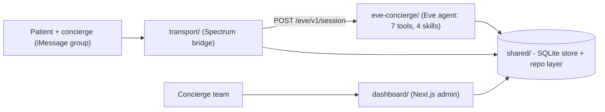

# Essos AI Health Tourism Concierge

A text-based AI concierge for health-tourism patients. **Eve** (the agent brain) joins the patient and concierge in their iMessage group chat, answers low-severity questions autonomously at any hour, and escalates anything higher-stakes to a human — with a Next.js admin dashboard as the single pane of glass over every conversation, escalation, and bit of agent telemetry.

Beachhead: rhinoplasty and hair-transplant patients in Turkey and Mexico.

> Work-trial MVP. All patient data is fictional/notional. PII/PHI hardening is an explicit later focus; this build optimizes for correct agent behavior, transport, dashboard visibility, and a working demo. See [Assumptions](#assumptions).

## Architecture



- **Eve = brain**, **Spectrum = transport**, connected over Eve's HTTP session API so the transport stays swappable (terminal for dev, iMessage for the live demo).
- **One shared SQLite file** is the source of truth for notional data, read/written by the agent tools and the dashboard.
- Eve answers low-severity messages in-thread and, on escalation, pings the human team and raises a flag in the dashboard while pausing automation for that conversation.

## Repo layout

```
AI Health Tourism Concierge/
├── shared/          @essos/shared — SQLite schema, repo layer, taxonomy, seed, config (workspace)
├── transport/       @essos/transport — Spectrum bridge (terminal + iMessage) (workspace)
├── dashboard/       @essos/dashboard — Next.js admin dashboard (workspace)
├── eve-concierge/   Eve agent app (isolated sub-project; authored surface in agent/)
├── mock-assets/     fixture pack: patient JSON, source-doc Markdown, generated PDFs
├── .docs/decisions/ architecture decision records (ADRs)
├── .context/        provided project source material
└── .essos_branding/ extracted brand tokens
```

`shared`, `transport`, and `dashboard` are pnpm workspace packages. `eve-concierge` is an isolated Eve sub-project with its own lockfile (it pins beta deps); it links `@essos/shared` via `link:`. See [ADR 005](.docs/decisions/005-eve-agent-project-structure.md).

## Prerequisites

- Node.js >= 22 (uses the built-in `node:sqlite`)
- pnpm 10+
- An Anthropic API key (the work-trial zero-data-retention key). Optional: a Google Places API key.

## Setup

```bash
# 1) install workspace deps
pnpm install
# (eve-concierge installs its own deps)
pnpm -C eve-concierge install

# 2) configure env
cp .env.example .env
# edit .env: set ANTHROPIC_API_KEY (sk-ant-...). eve-concierge/.env is a symlink to ../.env.

# 3) build the shared package and seed the local SQLite store
pnpm --filter @essos/shared run build
pnpm seed:reset
```

`seed:reset` populates `.data/essos.db` from `mock-assets/` (3 patients, source docs, itineraries, care docs, and a pre-seeded "stranded at arrivals" escalation).

## Run

Three processes (separate terminals):

```bash
# 1) Eve agent runtime (the brain) on :3000
pnpm eve:dev

# 2) transport bridge — pick one:
pnpm transport:terminal     # local: play the patient in your shell
pnpm transport:imessage     # live: Spectrum Cloud iMessage group chat

# 3) admin dashboard on :4000
pnpm dashboard:dev          # http://localhost:4000
```

Useful root scripts: `pnpm seed` / `pnpm seed:reset`, `pnpm eve:build`, `pnpm assets:generate` (regenerate PDFs), `pnpm typecheck` (all packages + the agent).

## Demo scenarios

Drive these as the patient (terminal, or iMessage in the group):

| Message | Expected behavior |
| --- | --- |
| "What's my hotel reservation number?" | Answers from the itinerary (`get_itinerary`). |
| "When do I need to stop eating before surgery?" | Quotes the verified pre-op packet (`get_care_instructions`). |
| "My flight is delayed — can you move my pickup?" | Routine logistics; records the coordination (`update_logistics`). |
| "Is this swelling on my nose normal?" | Non-clinical acknowledgement + **High** escalation, automation paused. |
| "Can I take ibuprofen tonight?" | Medication decision → escalates. |
| "I can't find my driver and no one's answering." | Stranded patient → escalates; tells them where to wait. |

Open flags surface on the dashboard Overview, where you can take over, resolve, and resume Eve.

When Eve escalates, the patient is never left in silence: Eve acknowledges in-thread, and if the patient keeps texting while a human is being looped in, they get a single "the care team is reviewing this" holding notice. The concierge can reply to the patient straight from the dashboard conversation view — those replies are delivered to the patient's iMessage by the transport and mark the thread taken over. See [ADR 010](.docs/decisions/010-handoff-patient-feedback-ux.md).

## Live iMessage runbook

1. Provision a Spectrum Cloud iMessage line (app.photon.codes); set `SPECTRUM_PROJECT_ID`/`SPECTRUM_PROJECT_SECRET` in `.env`.
2. **Bind a test number to a patient:** edit a patient `handle` in `mock-assets/patients/*.json` to the patient device's iMessage handle (E.164 phone or Apple ID email), then `pnpm seed:reset`. Inbound senders are matched to patients by exact handle.
3. Set `ESSOS_CONCIERGE_HANDLES` (comma-separated) to the concierge participants' real handles (not display names) so their messages don't trigger Eve and signal takeover.
4. Create the group chat containing the patient device, the concierge device, and the Spectrum agent line.
5. `pnpm eve:dev`, `pnpm transport:imessage`, `pnpm dashboard:dev`, then text from the patient device.

Eve and the transport here run on the same host, so Eve's `localDev()` route auth admits the transport with no extra config. If you deploy Eve to a non-loopback host, set the same `ESSOS_TRANSPORT_SECRET` on both so the transport authenticates ([ADR 009](.docs/decisions/009-agent-hardening-and-transport-auth.md)).

See [ADR 008](.docs/decisions/008-transport-eve-streaming-contract.md) for the transport/streaming details.

## Assumptions

- iMessage is the primary surface; the patient/concierge group chat is the primary space. Terminal transport is for development.
- **Spectrum Cloud over Sendblue** for first-class group chat + native mini-app cards ([ADR 004](.docs/decisions/004-spectrum-imessage-transport.md)).
- The model routes **directly to Anthropic** (not the AI Gateway) using the ZDR key, keeping PHI off a third-party gateway ([ADR 006](.docs/decisions/006-model-routing-direct-anthropic.md)).
- Notional data; local SQLite store; agent + DB + dashboard run locally while iMessage transport goes through Spectrum Cloud.
- Pre-op questions are answerable when directly documented; medication decisions, post-op symptoms/recovery, staff-safety concerns, out-of-package requests, and unsure cases escalate ([ADR 001](.docs/decisions/001-escalation-taxonomy.md), [ADR 002](.docs/decisions/002-care-instructions-source-of-truth.md)).
- Mini-app cards and PII/PHI hardening are later-focus items after the text-first system is working.

## Decision records

See [.docs/decisions/](.docs/decisions/README.md) for the full ADR index:

| # | Decision |
| --- | --- |
| [001](.docs/decisions/001-escalation-taxonomy.md) | Escalation taxonomy |
| [002](.docs/decisions/002-care-instructions-source-of-truth.md) | Care-instructions source of truth |
| [003](.docs/decisions/003-human-handoff-and-takeover.md) | Human handoff and takeover |
| [004](.docs/decisions/004-spectrum-imessage-transport.md) | Spectrum iMessage transport |
| [005](.docs/decisions/005-eve-agent-project-structure.md) | Eve agent project structure |
| [006](.docs/decisions/006-model-routing-direct-anthropic.md) | Model routing: direct Anthropic |
| [007](.docs/decisions/007-admin-dashboard-architecture.md) | Admin dashboard architecture |
| [008](.docs/decisions/008-transport-eve-streaming-contract.md) | Transport / Eve streaming contract |
| [009](.docs/decisions/009-agent-hardening-and-transport-auth.md) | Agent hardening and transport auth |
| [010](.docs/decisions/010-handoff-patient-feedback-ux.md) | Handoff patient feedback + concierge reply bridge |

## Package docs

- [eve-concierge/README.md](eve-concierge/README.md) — the agent brain (tools, skills, instructions, model)
- [transport/README.md](transport/README.md) — the Spectrum bridge
- [dashboard/README.md](dashboard/README.md) — the admin dashboard
- [shared/README.md](shared/README.md) — schema, repo layer, seed
- [mock-assets/README.md](mock-assets/README.md) — the fixture pack
